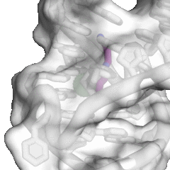
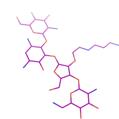
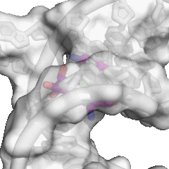
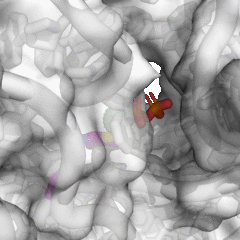
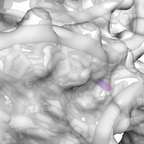
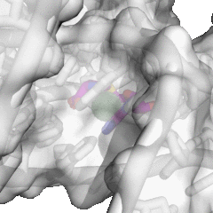
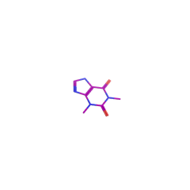
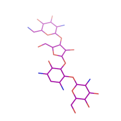

# RNACavityMiner Dataset

<!-- HTML CODE-->

<!DOCTYPE html>
<html>
  <body>
    <h3 align="center" >Summary of data used to train and test RNACavityMiner</h3>
    <table  align="center" border="3" style="table-layout: auto width: 250px;">
      <tr>
          <th>Index</th>
          <th>Set</th>
          <th>PDB</th>
          <th>SMILES</th>
          <th>QED</th>
          <th> Affinity (nM)</th>
          <th>Ligand SASA (&#8491;)</th>
          <th>Ligand</th>
          <th>Pocket View</th>
      </tr>
<tr>
<td halign="center" style="word-wrap: break-word;" valign="top">
  
 1 

</td>
<td halign="center" style="word-wrap: break-word;" valign="top">
  
 Training 

</td>
  <td halign="center" style="word-wrap: break-word;" valign="top">
    
 1F27 

  </td>
  </td>
  <td halign="center" style="word-wrap: break-word;" valign="top">
    
 C(=O)([O-])CCCC[C@@H]1SC[C@@H]2NC(=O)N[C@H]12	 

  </td>
  </td>
  <td halign="center" style="word-wrap: break-word;" valign="top">
    
 0.502 

  </td>
  </td>
  <td halign="center" style="word-wrap: break-word;" valign="top">
    
 1000.00 

  </td>
  </td>
  <td halign="center" style="word-wrap: break-word;" valign="top">
    
 3.19 

  </td>
  </td>
<td halign="center" style="word-wrap: break-word;" valign="top">
  

     
  

</td>
<td halign="center" style="word-wrap: break-word;" valign="top">
  

     
  

</td>
</tr>
<tr>
<td halign="center" style="word-wrap: break-word;" valign="top">
  
 2 

</td>
<td halign="center" style="word-wrap: break-word;" valign="top">
  
 Training 

</td>
  <td halign="center" style="word-wrap: break-word;" valign="top">
    
 1FUF 

  </td>
  </td>
  <td halign="center" style="word-wrap: break-word;" valign="top">
    
 NCCCNCCCCNCCCN	 

  </td>
  </td>
  <td halign="center" style="word-wrap: break-word;" valign="top">
    
 0.345 

  </td>
  </td>
  <td halign="center" style="word-wrap: break-word;" valign="top">
    
 n.a. 

  </td>
  </td>
  <td halign="center" style="word-wrap: break-word;" valign="top">
    
 3.02 

  </td>
  </td>
<td halign="center" style="word-wrap: break-word;" valign="top">
  

     
  

</td>
<td halign="center" style="word-wrap: break-word;" valign="top">
  

     
  

</td>
</tr>
<tr>
<td halign="center" style="word-wrap: break-word;" valign="top">
  
 3 

</td>
<td halign="center" style="word-wrap: break-word;" valign="top">
  
 Training 

</td>
  <td halign="center" style="word-wrap: break-word;" valign="top">
    
 1J7T 

  </td>
  </td>
  <td halign="center" style="word-wrap: break-word;" valign="top">
    
 C1(OC2C(CC(N)C(C2OC2C(O)C(OC3C(N)C(O)C(O)C(O3)CN)C(O2)CO)O)N)C(N)C(O)C(O)C(O1)CO	 

  </td>
  </td>
  <td halign="center" style="word-wrap: break-word;" valign="top">
    
 0.114 

  </td>
  </td>
  <td halign="center" style="word-wrap: break-word;" valign="top">
    
 n.a. 

  </td>
  </td>
  <td halign="center" style="word-wrap: break-word;" valign="top">
    
 7.11 

  </td>
  </td>
<td halign="center" style="word-wrap: break-word;" valign="top">
  

     
  

</td>
<td halign="center" style="word-wrap: break-word;" valign="top">
  

     
  

</td>
</tr>
<tr>
<td halign="center" style="word-wrap: break-word;" valign="top">
  
 4 

</td>
<td halign="center" style="word-wrap: break-word;" valign="top">
  
 Training 

</td>
  <td halign="center" style="word-wrap: break-word;" valign="top">
    
 1LC4 

  </td>
  </td>
  <td halign="center" style="word-wrap: break-word;" valign="top">
    
 C1(OC2C(CC(N)C(C2O)OC2C(O)C(N)C(O)C(O2)CO)N)C(N)CC(O)C(O1)CN	 

  </td>
  </td>
  <td halign="center" style="word-wrap: break-word;" valign="top">
    
 0.174 

  </td>
  </td>
  <td halign="center" style="word-wrap: break-word;" valign="top">
    
 n.a. 

  </td>
  </td>
  <td halign="center" style="word-wrap: break-word;" valign="top">
    
 8.79 

  </td>
  </td>
<td halign="center" style="word-wrap: break-word;" valign="top">
  

     
  

</td>
<td halign="center" style="word-wrap: break-word;" valign="top">
  

     
  

</td>
</tr>
<tr>
<td halign="center" style="word-wrap: break-word;" valign="top">
  
 5 

</td>
<td halign="center" style="word-wrap: break-word;" valign="top">
  
 Training 

</td>
  <td halign="center" style="word-wrap: break-word;" valign="top">
    
 1MWL 

  </td>
  </td>
  <td halign="center" style="word-wrap: break-word;" valign="top">
    
 C1(OC2C(CC(N)C(C2O)OC2C(O)C(NC)C(O)(C)CO2)N)C(N)C(O)C(O)C(O1)C(O)C	 

  </td>
  </td>
  <td halign="center" style="word-wrap: break-word;" valign="top">
    
 0.165 

  </td>
  </td>
  <td halign="center" style="word-wrap: break-word;" valign="top">
    
 n.a. 

  </td>
  </td>
  <td halign="center" style="word-wrap: break-word;" valign="top">
    
 10.07 

  </td>
  </td>
<td halign="center" style="word-wrap: break-word;" valign="top">
  

     
  

</td>
<td halign="center" style="word-wrap: break-word;" valign="top">
  

     
  

</td>
</tr>
<tr>
<td halign="center" style="word-wrap: break-word;" valign="top">
  
 6 

</td>
<td halign="center" style="word-wrap: break-word;" valign="top">
  
 Training 

</td>
  <td halign="center" style="word-wrap: break-word;" valign="top">
    
 1NTA 

  </td>
  </td>
  <td halign="center" style="word-wrap: break-word;" valign="top">
    
 C(N)(N[C@@H]1[C@@H](O)[C@H](NC(N)N)[C@@H](O[C@H]2[C@H](O[C@H]3[C@@H](NC)[C@H](O)[C@@H](O)[C@@H](O3)CO)[C@](CO)(O)[C@H](C)O2)[C@H](O)[C@H]1O)N	 

  </td>
  </td>
  <td halign="center" style="word-wrap: break-word;" valign="top">
    
 0.100 

  </td>
  </td>
  <td halign="center" style="word-wrap: break-word;" valign="top">
    
 n.a. 

  </td>
  </td>
  <td halign="center" style="word-wrap: break-word;" valign="top">
    
 10.49 

  </td>
  </td>
<td halign="center" style="word-wrap: break-word;" valign="top">
  

     
  

</td>
<td halign="center" style="word-wrap: break-word;" valign="top">
  

     
  

</td>
</tr>
<tr>
<td halign="center" style="word-wrap: break-word;" valign="top">
  
 7 

</td>
<td halign="center" style="word-wrap: break-word;" valign="top">
  
 Training 

</td>
  <td halign="center" style="word-wrap: break-word;" valign="top">
    
 1NTB 

  </td>
  </td>
  <td halign="center" style="word-wrap: break-word;" valign="top">
    
 C(N)(N[C@@H]1[C@@H](O)[C@H](NC(N)N)[C@@H](O[C@H]2[C@H](O[C@H]3[C@@H](NC)[C@H](O)[C@@H](O)[C@@H](O3)CO)[C@](CO)(O)[C@H](C)O2)[C@H](O)[C@H]1O)N	 

  </td>
  </td>
  <td halign="center" style="word-wrap: break-word;" valign="top">
    
 0.100 

  </td>
  </td>
  <td halign="center" style="word-wrap: break-word;" valign="top">
    
 n.a. 

  </td>
  </td>
  <td halign="center" style="word-wrap: break-word;" valign="top">
    
 9.79 

  </td>
  </td>
<td halign="center" style="word-wrap: break-word;" valign="top">
  

     
  

</td>
<td halign="center" style="word-wrap: break-word;" valign="top">
  

     
  

</td>
</tr>
<tr>
<td halign="center" style="word-wrap: break-word;" valign="top">
  
 8 

</td>
<td halign="center" style="word-wrap: break-word;" valign="top">
  
 Training 

</td>
  <td halign="center" style="word-wrap: break-word;" valign="top">
    
 1O9M 

  </td>
  </td>
  <td halign="center" style="word-wrap: break-word;" valign="top">
    
 [C@@H]1(O[C@H]2[C@@H]([C@H]([C@H](NC(=O)[C@H](O)CCN)C[C@@H]2N)OCCNCCCCN)O)[C@H](N)[C@@H](O)[C@H](O)[C@H](O1)CN	 

  </td>
  </td>
  <td halign="center" style="word-wrap: break-word;" valign="top">
    
 0.087 

  </td>
  </td>
  <td halign="center" style="word-wrap: break-word;" valign="top">
    
 n.a. 

  </td>
  </td>
  <td halign="center" style="word-wrap: break-word;" valign="top">
    
 13.87 

  </td>
  </td>
<td halign="center" style="word-wrap: break-word;" valign="top">
  

     
  

</td>
<td halign="center" style="word-wrap: break-word;" valign="top">
  

     
  

</td>
</tr>
<tr>
<td halign="center" style="word-wrap: break-word;" valign="top">
  
 9 

</td>
<td halign="center" style="word-wrap: break-word;" valign="top">
  
 Training 

</td>
  <td halign="center" style="word-wrap: break-word;" valign="top">
    
 1U8D 

  </td>
  </td>
  <td halign="center" style="word-wrap: break-word;" valign="top">
    
 [nH]1cnc2c(c1=O)[nH]cn2	 

  </td>
  </td>
  <td halign="center" style="word-wrap: break-word;" valign="top">
    
 0.519 

  </td>
  </td>
  <td halign="center" style="word-wrap: break-word;" valign="top">
    
 n.a. 

  </td>
  </td>
  <td halign="center" style="word-wrap: break-word;" valign="top">
    
 2.21 

  </td>
  </td>
<td halign="center" style="word-wrap: break-word;" valign="top">
  

     
  

</td>
<td halign="center" style="word-wrap: break-word;" valign="top">
  

     
  

</td>
</tr>
<tr>
<td halign="center" style="word-wrap: break-word;" valign="top">
  
 10 

</td>
<td halign="center" style="word-wrap: break-word;" valign="top">
  
 Training 

</td>
  <td halign="center" style="word-wrap: break-word;" valign="top">
    
 1YRJ 

  </td>
  </td>
  <td halign="center" style="word-wrap: break-word;" valign="top">
    
 [C@H]1([C@@H](C[C@H]2[C@@H]([C@@H]([C@@H]([C@H](O2)O[C@@H]2[C@@H]([C@H]([C@@H]([C@@H](CO)O2)N)O)O)NC)O)O1)N)O[C@H]1[C@@H]([C@H]([C@@H](C[C@@H]1N)N)O)O	 

  </td>
  </td>
  <td halign="center" style="word-wrap: break-word;" valign="top">
    
 0.149 

  </td>
  </td>
  <td halign="center" style="word-wrap: break-word;" valign="top">
    
 200.00 

  </td>
  </td>
  <td halign="center" style="word-wrap: break-word;" valign="top">
    
 9.42 

  </td>
  </td>
<td halign="center" style="word-wrap: break-word;" valign="top">
  

     
  

</td>
<td halign="center" style="word-wrap: break-word;" valign="top">
  

     
  

</td>
</tr>
<tr>
<td halign="center" style="word-wrap: break-word;" valign="top">
  
 11 

</td>
<td halign="center" style="word-wrap: break-word;" valign="top">
  
 Training 

</td>
  <td halign="center" style="word-wrap: break-word;" valign="top">
    
 1ZZ5 

  </td>
  </td>
  <td halign="center" style="word-wrap: break-word;" valign="top">
    
 [C@@H]12O[C@@H]3[C@H](C[C@@H](N)[C@@H]([C@H]3O[C@H]3[C@H](O)[C@H](O[C@@H]4[C@H](N)[C@@H](O)[C@H](O)[C@@H](O4)CN)[C@H](O3)CN[C@@H]1[C@@H](O)[C@H](O)[C@H](O2)CN)O)N	 

  </td>
  </td>
  <td halign="center" style="word-wrap: break-word;" valign="top">
    
 0.143 

  </td>
  </td>
  <td halign="center" style="word-wrap: break-word;" valign="top">
    
 n.a. 

  </td>
  </td>
  <td halign="center" style="word-wrap: break-word;" valign="top">
    
 6.65 

  </td>
  </td>
<td halign="center" style="word-wrap: break-word;" valign="top">
  

     
  

</td>
<td halign="center" style="word-wrap: break-word;" valign="top">
  

     
  

</td>
</tr>
<tr>
<td halign="center" style="word-wrap: break-word;" valign="top">
  
 12 

</td>
<td halign="center" style="word-wrap: break-word;" valign="top">
  
 Training 

</td>
  <td halign="center" style="word-wrap: break-word;" valign="top">
    
 2BE0 

  </td>
  </td>
  <td halign="center" style="word-wrap: break-word;" valign="top">
    
 [C@@H]1(O[C@@H]2[C@H](C[C@@H](N)[C@@H]([C@H]2O[C@@H]2O[C@@H]([C@H]([C@H]2OCCNCc2cnccc2)O[C@@H]2[C@H](N)[C@@H](O)[C@H](O)[C@@H](O2)CN)CO)O)N)[C@H](N)[C@@H](O)[C@H](O)[C@H](O1)CO	 

  </td>
  </td>
  <td halign="center" style="word-wrap: break-word;" valign="top">
    
 0.074 

  </td>
  </td>
  <td halign="center" style="word-wrap: break-word;" valign="top">
    
 130.00 

  </td>
  </td>
  <td halign="center" style="word-wrap: break-word;" valign="top">
    
 13.44 

  </td>
  </td>
<td halign="center" style="word-wrap: break-word;" valign="top">
  

     
  

</td>
<td halign="center" style="word-wrap: break-word;" valign="top">
  

     
  

</td>
</tr>
<tr>
<td halign="center" style="word-wrap: break-word;" valign="top">
  
 13 

</td>
<td halign="center" style="word-wrap: break-word;" valign="top">
  
 Training 

</td>
  <td halign="center" style="word-wrap: break-word;" valign="top">
    
 2BEE 

  </td>
  </td>
  <td halign="center" style="word-wrap: break-word;" valign="top">
    
 [C@@H]1(O[C@@H]2[C@H](C[C@@H](N)[C@@H]([C@H]2O[C@H]2[C@H](OCCNCCCN)[C@H](O[C@@H]3[C@H](N)[C@@H](O)[C@H](O)[C@@H](O3)CN)[C@H](O2)CO)O)N)[C@H](N)[C@@H](O)[C@H](O)[C@H](O1)CO	 

  </td>
  </td>
  <td halign="center" style="word-wrap: break-word;" valign="top">
    
 0.066 

  </td>
  </td>
  <td halign="center" style="word-wrap: break-word;" valign="top">
    
 100.00 

  </td>
  </td>
  <td halign="center" style="word-wrap: break-word;" valign="top">
    
 12.73 

  </td>
  </td>
<td halign="center" style="word-wrap: break-word;" valign="top">
  

     
  

</td>
<td halign="center" style="word-wrap: break-word;" valign="top">
  

     
  

</td>
</tr>
<tr>
<td halign="center" style="word-wrap: break-word;" valign="top">
  
 14 

</td>
<td halign="center" style="word-wrap: break-word;" valign="top">
  
 Training 

</td>
  <td halign="center" style="word-wrap: break-word;" valign="top">
    
 2CKY 

  </td>
  </td>
  <td halign="center" style="word-wrap: break-word;" valign="top">
    
 Cc1nc(c(CN2CS[C@H]([C@H]2C)CCO[P@](=O)([O-])O[P@](=O)(O)[O-])cn1)N	 

  </td>
  </td>
  <td halign="center" style="word-wrap: break-word;" valign="top">
    
 0.533 

  </td>
  </td>
  <td halign="center" style="word-wrap: break-word;" valign="top">
    
 n.a. 

  </td>
  </td>
  <td halign="center" style="word-wrap: break-word;" valign="top">
    
 8.85 

  </td>
  </td>
<td halign="center" style="word-wrap: break-word;" valign="top">
  

     
  

</td>
<td halign="center" style="word-wrap: break-word;" valign="top">
  

     
  

</td>
</tr>
<tr>
<td halign="center" style="word-wrap: break-word;" valign="top">
  
 15 

</td>
<td halign="center" style="word-wrap: break-word;" valign="top">
  
 Training 

</td>
  <td halign="center" style="word-wrap: break-word;" valign="top">
    
 2EEU 

  </td>
  </td>
  <td halign="center" style="word-wrap: break-word;" valign="top">
    
 [nH]1cnc2c(c1=O)[nH]cn2	 

  </td>
  </td>
  <td halign="center" style="word-wrap: break-word;" valign="top">
    
 0.519 

  </td>
  </td>
  <td halign="center" style="word-wrap: break-word;" valign="top">
    
 n.a. 

  </td>
  </td>
  <td halign="center" style="word-wrap: break-word;" valign="top">
    
 1.98 

  </td>
  </td>
<td halign="center" style="word-wrap: break-word;" valign="top">
  

     
  

</td>
<td halign="center" style="word-wrap: break-word;" valign="top">
  

     
  

</td>
</tr>
<tr>
<td halign="center" style="word-wrap: break-word;" valign="top">
  
 16 

</td>
<td halign="center" style="word-wrap: break-word;" valign="top">
  
 Training 

</td>
  <td halign="center" style="word-wrap: break-word;" valign="top">
    
 2EEV 

  </td>
  </td>
  <td halign="center" style="word-wrap: break-word;" valign="top">
    
 [nH]1cnc2c(c1=O)[nH]cn2	 

  </td>
  </td>
  <td halign="center" style="word-wrap: break-word;" valign="top">
    
 0.519 

  </td>
  </td>
  <td halign="center" style="word-wrap: break-word;" valign="top">
    
 n.a. 

  </td>
  </td>
  <td halign="center" style="word-wrap: break-word;" valign="top">
    
 3.74 

  </td>
  </td>
<td halign="center" style="word-wrap: break-word;" valign="top">
  

     
  

</td>
<td halign="center" style="word-wrap: break-word;" valign="top">
  

     
  

</td>
</tr>
<tr>
<td halign="center" style="word-wrap: break-word;" valign="top">
  
 17 

</td>
<td halign="center" style="word-wrap: break-word;" valign="top">
  
 Training 

</td>
  <td halign="center" style="word-wrap: break-word;" valign="top">
    
 2EEW 

  </td>
  </td>
  <td halign="center" style="word-wrap: break-word;" valign="top">
    
 [nH]1cnc2c(c1=O)[nH]cn2	 

  </td>
  </td>
  <td halign="center" style="word-wrap: break-word;" valign="top">
    
 0.519 

  </td>
  </td>
  <td halign="center" style="word-wrap: break-word;" valign="top">
    
 n.a. 

  </td>
  </td>
  <td halign="center" style="word-wrap: break-word;" valign="top">
    
 2.38 

  </td>
  </td>
<td halign="center" style="word-wrap: break-word;" valign="top">
  

     
  

</td>
<td halign="center" style="word-wrap: break-word;" valign="top">
  

     
  

</td>
</tr>
<tr>
<td halign="center" style="word-wrap: break-word;" valign="top">
  
 18 

</td>
<td halign="center" style="word-wrap: break-word;" valign="top">
  
 Training 

</td>
  <td halign="center" style="word-wrap: break-word;" valign="top">
    
 2ET3 

  </td>
  </td>
  <td halign="center" style="word-wrap: break-word;" valign="top">
    
 [C@@H]1(O[C@@H]2[C@H](C[C@@H](N)[C@@H]([C@H]2O)O[C@@H]2[C@H](O)[C@@H](NC)[C@@](O)(CO2)C)N)[C@H](N)CC[C@H](O1)CN	 

  </td>
  </td>
  <td halign="center" style="word-wrap: break-word;" valign="top">
    
 0.195 

  </td>
  </td>
  <td halign="center" style="word-wrap: break-word;" valign="top">
    
 n.a. 

  </td>
  </td>
  <td halign="center" style="word-wrap: break-word;" valign="top">
    
 6.93 

  </td>
  </td>
<td halign="center" style="word-wrap: break-word;" valign="top">
  

     
  

</td>
<td halign="center" style="word-wrap: break-word;" valign="top">
  

     
  

</td>
</tr>
<tr>
<td halign="center" style="word-wrap: break-word;" valign="top">
  
 19 

</td>
<td halign="center" style="word-wrap: break-word;" valign="top">
  
 Training 

</td>
  <td halign="center" style="word-wrap: break-word;" valign="top">
    
 2ET4 

  </td>
  </td>
  <td halign="center" style="word-wrap: break-word;" valign="top">
    
 [C@@H]1(O[C@@H]2[C@H](C[C@@H](N)[C@@H]([C@H]2O[C@H]2[C@H](O)[C@@H]([C@H](O2)CO)O[C@@H]2[C@@H]([C@@H](O)[C@H](O)[C@@H](O2)CN)N)O)N)[C@H](N)[C@@H](O)[C@H](O)[C@H](O1)CN	 

  </td>
  </td>
  <td halign="center" style="word-wrap: break-word;" valign="top">
    
 0.115 

  </td>
  </td>
  <td halign="center" style="word-wrap: break-word;" valign="top">
    
 n.a. 

  </td>
  </td>
  <td halign="center" style="word-wrap: break-word;" valign="top">
    
 11.90 

  </td>
  </td>
<td halign="center" style="word-wrap: break-word;" valign="top">
  

     
  

</td>
<td halign="center" style="word-wrap: break-word;" valign="top">
  

     
  

</td>
</tr>
<tr>
<td halign="center" style="word-wrap: break-word;" valign="top">
  
 20 

</td>
<td halign="center" style="word-wrap: break-word;" valign="top">
  
 Training 

</td>
  <td halign="center" style="word-wrap: break-word;" valign="top">
    
 2ET5 

  </td>
  </td>
  <td halign="center" style="word-wrap: break-word;" valign="top">
    
 C(O)[C@H]1O[C@@H](O[C@@H]2[C@@H](O)[C@H](N)C[C@H](N)[C@H]2O[C@H]2O[C@H](CN)[C@@H](O)[C@H](O)[C@H]2N)[C@H](O)[C@@H]1O	 

  </td>
  </td>
  <td halign="center" style="word-wrap: break-word;" valign="top">
    
 0.179 

  </td>
  </td>
  <td halign="center" style="word-wrap: break-word;" valign="top">
    
 n.a. 

  </td>
  </td>
  <td halign="center" style="word-wrap: break-word;" valign="top">
    
 6.75 

  </td>
  </td>
<td halign="center" style="word-wrap: break-word;" valign="top">
  

     
  

</td>
<td halign="center" style="word-wrap: break-word;" valign="top">
  

     
  

</td>
</tr>
<tr>
<td halign="center" style="word-wrap: break-word;" valign="top">
  
 21 

</td>
<td halign="center" style="word-wrap: break-word;" valign="top">
  
 Training 

</td>
  <td halign="center" style="word-wrap: break-word;" valign="top">
    
 2ET8 

  </td>
  </td>
  <td halign="center" style="word-wrap: break-word;" valign="top">
    
 N[C@H]1[C@@H]([C@@H](O)[C@H](O[C@H]2O[C@H](CN)[C@@H](O)[C@H](O)[C@H]2N)[C@@H](N)C1)O	 

  </td>
  </td>
  <td halign="center" style="word-wrap: break-word;" valign="top">
    
 0.248 

  </td>
  </td>
  <td halign="center" style="word-wrap: break-word;" valign="top">
    
 n.a. 

  </td>
  </td>
  <td halign="center" style="word-wrap: break-word;" valign="top">
    
 5.98 

  </td>
  </td>
<td halign="center" style="word-wrap: break-word;" valign="top">
  

     
  

</td>
<td halign="center" style="word-wrap: break-word;" valign="top">
  

     
  

</td>
</tr>
<tr>
<td halign="center" style="word-wrap: break-word;" valign="top">
  
 22 

</td>
<td halign="center" style="word-wrap: break-word;" valign="top">
  
 Training 

</td>
  <td halign="center" style="word-wrap: break-word;" valign="top">
    
 2F4S 

  </td>
  </td>
  <td halign="center" style="word-wrap: break-word;" valign="top">
    
 N[C@H]1[C@@H]([C@@H](O)[C@H](O[C@H]2O[C@H](CN)[C@@H](O)[C@H](O)[C@H]2N)[C@@H](N)C1)O	 

  </td>
  </td>
  <td halign="center" style="word-wrap: break-word;" valign="top">
    
 0.248 

  </td>
  </td>
  <td halign="center" style="word-wrap: break-word;" valign="top">
    
 19000.00 

  </td>
  </td>
  <td halign="center" style="word-wrap: break-word;" valign="top">
    
 12.02 

  </td>
  </td>
<td halign="center" style="word-wrap: break-word;" valign="top">
  

     
  

</td>
<td halign="center" style="word-wrap: break-word;" valign="top">
  

     
  

</td>
</tr>
<tr>
<td halign="center" style="word-wrap: break-word;" valign="top">
  
 23 

</td>
<td halign="center" style="word-wrap: break-word;" valign="top">
  
 Training 

</td>
  <td halign="center" style="word-wrap: break-word;" valign="top">
    
 2F4T 

  </td>
  </td>
  <td halign="center" style="word-wrap: break-word;" valign="top">
    
 [C@@H]1(O[C@@H]2[C@H](C[C@@H](NC(=O)[C@@H](CCN)O)[C@@H]([C@H]2O)OCCNCCN)N)[C@H](N)[C@@H](O)[C@H](O)[C@H](O1)C=N	 

  </td>
  </td>
  <td halign="center" style="word-wrap: break-word;" valign="top">
    
 0.082 

  </td>
  </td>
  <td halign="center" style="word-wrap: break-word;" valign="top">
    
 2200.00 

  </td>
  </td>
  <td halign="center" style="word-wrap: break-word;" valign="top">
    
 14.59 

  </td>
  </td>
<td halign="center" style="word-wrap: break-word;" valign="top">
  

     
  

</td>
<td halign="center" style="word-wrap: break-word;" valign="top">
  

     
  

</td>
</tr>
<tr>
<td halign="center" style="word-wrap: break-word;" valign="top">
  
 24 

</td>
<td halign="center" style="word-wrap: break-word;" valign="top">
  
 Training 

</td>
  <td halign="center" style="word-wrap: break-word;" valign="top">
    
 2F4U 

  </td>
  </td>
  <td halign="center" style="word-wrap: break-word;" valign="top">
    
 [C@@H]1(O[C@@H]2[C@H](C[C@@H](NC(=O)[C@@H](CCN)O)[C@@H]([C@H]2O)OCCNCCCN)N)[C@H](N)[C@@H](O)[C@H](O)[C@H](O1)CO	 

  </td>
  </td>
  <td halign="center" style="word-wrap: break-word;" valign="top">
    
 0.094 

  </td>
  </td>
  <td halign="center" style="word-wrap: break-word;" valign="top">
    
 5900.00 

  </td>
  </td>
  <td halign="center" style="word-wrap: break-word;" valign="top">
    
 14.45 

  </td>
  </td>
<td halign="center" style="word-wrap: break-word;" valign="top">
  

     
  

</td>
<td halign="center" style="word-wrap: break-word;" valign="top">
  

     
  

</td>
</tr>
<tr>
<td halign="center" style="word-wrap: break-word;" valign="top">
  
 25 

</td>
<td halign="center" style="word-wrap: break-word;" valign="top">
  
 Training 

</td>
  <td halign="center" style="word-wrap: break-word;" valign="top">
    
 2FCX 

  </td>
  </td>
  <td halign="center" style="word-wrap: break-word;" valign="top">
    
 N[C@H]1[C@@H]([C@@H](O)[C@H](O[C@H]2O[C@H](CN)[C@@H](O)[C@H](O)[C@H]2N)[C@@H](N)C1)O	 

  </td>
  </td>
  <td halign="center" style="word-wrap: break-word;" valign="top">
    
 0.248 

  </td>
  </td>
  <td halign="center" style="word-wrap: break-word;" valign="top">
    
 n.a. 

  </td>
  </td>
  <td halign="center" style="word-wrap: break-word;" valign="top">
    
 7.21 

  </td>
  </td>
<td halign="center" style="word-wrap: break-word;" valign="top">
  

     
  

</td>
<td halign="center" style="word-wrap: break-word;" valign="top">
  

     
  

</td>
</tr>
<tr>
<td halign="center" style="word-wrap: break-word;" valign="top">
  
 26 

</td>
<td halign="center" style="word-wrap: break-word;" valign="top">
  
 Training 

</td>
  <td halign="center" style="word-wrap: break-word;" valign="top">
    
 2FCY 

  </td>
  </td>
  <td halign="center" style="word-wrap: break-word;" valign="top">
    
 [C@@H]1(O[C@@H]2[C@H](C[C@@H](N)[C@@H]([C@H]2O[C@H]2[C@H](O)[C@@H]([C@H](O2)CO)O[C@@H]2[C@@H]([C@@H](O)[C@H](O)[C@@H](O2)CN)N)O)N)[C@H](N)[C@@H](O)[C@H](O)[C@H](O1)CN	 

  </td>
  </td>
  <td halign="center" style="word-wrap: break-word;" valign="top">
    
 0.115 

  </td>
  </td>
  <td halign="center" style="word-wrap: break-word;" valign="top">
    
 n.a. 

  </td>
  </td>
  <td halign="center" style="word-wrap: break-word;" valign="top">
    
 7.85 

  </td>
  </td>
<td halign="center" style="word-wrap: break-word;" valign="top">
  

     
  

</td>
<td halign="center" style="word-wrap: break-word;" valign="top">
  

     
  

</td>
</tr>
<tr>
<td halign="center" style="word-wrap: break-word;" valign="top">
  
 27 

</td>
<td halign="center" style="word-wrap: break-word;" valign="top">
  
 Training 

</td>
  <td halign="center" style="word-wrap: break-word;" valign="top">
    
 2FCZ 

  </td>
  </td>
  <td halign="center" style="word-wrap: break-word;" valign="top">
    
 C(O)[C@H]1O[C@@H](O[C@@H]2[C@@H](O)[C@H](N)C[C@H](N)[C@H]2O[C@H]2O[C@H](CN)[C@@H](O)[C@H](O)[C@H]2N)[C@H](O)[C@@H]1O	 

  </td>
  </td>
  <td halign="center" style="word-wrap: break-word;" valign="top">
    
 0.179 

  </td>
  </td>
  <td halign="center" style="word-wrap: break-word;" valign="top">
    
 n.a. 

  </td>
  </td>
  <td halign="center" style="word-wrap: break-word;" valign="top">
    
 5.52 

  </td>
  </td>
<td halign="center" style="word-wrap: break-word;" valign="top">
  

     
  

</td>
<td halign="center" style="word-wrap: break-word;" valign="top">
  

     
  

</td>
</tr>
<tr>
<td halign="center" style="word-wrap: break-word;" valign="top">
  
 28 

</td>
<td halign="center" style="word-wrap: break-word;" valign="top">
  
 Training 

</td>
  <td halign="center" style="word-wrap: break-word;" valign="top">
    
 2G5Q 

  </td>
  </td>
  <td halign="center" style="word-wrap: break-word;" valign="top">
    
 [C@@H]1(O[C@@H]2[C@H](C[C@@H](NC(=O)[C@@H](CCN)O)[C@@H]([C@H]2O)O[C@@H]2[C@H](O)[C@@H](N)[C@H](O)[C@H](O2)CO)N)[C@@H]([C@H]([C@H](O)[C@H](O1)CN)O)O	 

  </td>
  </td>
  <td halign="center" style="word-wrap: break-word;" valign="top">
    
 0.113 

  </td>
  </td>
  <td halign="center" style="word-wrap: break-word;" valign="top">
    
 n.a. 

  </td>
  </td>
  <td halign="center" style="word-wrap: break-word;" valign="top">
    
 14.57 

  </td>
  </td>
<td halign="center" style="word-wrap: break-word;" valign="top">
  

     
  

</td>
<td halign="center" style="word-wrap: break-word;" valign="top">
  

     
  

</td>
</tr>
<tr>
<td halign="center" style="word-wrap: break-word;" valign="top">
  
 29 

</td>
<td halign="center" style="word-wrap: break-word;" valign="top">
  
 Training 

</td>
  <td halign="center" style="word-wrap: break-word;" valign="top">
    
 2HOJ 

  </td>
  </td>
  <td halign="center" style="word-wrap: break-word;" valign="top">
    
 Cc1nc(c(CN2CS[C@H]([C@@H]2C)CCO[P@@](=O)([O-])O[P@@](=O)(O)[O-])cn1)N	 

  </td>
  </td>
  <td halign="center" style="word-wrap: break-word;" valign="top">
    
 0.533 

  </td>
  </td>
  <td halign="center" style="word-wrap: break-word;" valign="top">
    
 n.a. 

  </td>
  </td>
  <td halign="center" style="word-wrap: break-word;" valign="top">
    
 6.01 

  </td>
  </td>
<td halign="center" style="word-wrap: break-word;" valign="top">
  

     
  

</td>
<td halign="center" style="word-wrap: break-word;" valign="top">
  

     
  

</td>
</tr>
<tr>
<td halign="center" style="word-wrap: break-word;" valign="top">
  
 30 

</td>
<td halign="center" style="word-wrap: break-word;" valign="top">
  
 Training 

</td>
  <td halign="center" style="word-wrap: break-word;" valign="top">
    
 2HOM 

  </td>
  </td>
  <td halign="center" style="word-wrap: break-word;" valign="top">
    
 Cc1ncc(c(n1)N)CN1CS[C@@H]([C@@H]1C)CCO[P@](=O)(O)[O-]	 

  </td>
  </td>
  <td halign="center" style="word-wrap: break-word;" valign="top">
    
 0.707 

  </td>
  </td>
  <td halign="center" style="word-wrap: break-word;" valign="top">
    
 n.a. 

  </td>
  </td>
  <td halign="center" style="word-wrap: break-word;" valign="top">
    
 5.57 

  </td>
  </td>
<td halign="center" style="word-wrap: break-word;" valign="top">
  

     
  

</td>
<td halign="center" style="word-wrap: break-word;" valign="top">
  

     
  

</td>
</tr>
<tr>
<td halign="center" style="word-wrap: break-word;" valign="top">
  
 31 

</td>
<td halign="center" style="word-wrap: break-word;" valign="top">
  
 Training 

</td>
  <td halign="center" style="word-wrap: break-word;" valign="top">
    
 2HOO 

  </td>
  </td>
  <td halign="center" style="word-wrap: break-word;" valign="top">
    
 C(=O)(c1ccccc1)S[C@@H]([C@H](C)N(CO)Cc1c(nc(C)nc1)N)CCO[P@](=O)(O)[O-]	 

  </td>
  </td>
  <td halign="center" style="word-wrap: break-word;" valign="top">
    
 0.321 

  </td>
  </td>
  <td halign="center" style="word-wrap: break-word;" valign="top">
    
 n.a. 

  </td>
  </td>
  <td halign="center" style="word-wrap: break-word;" valign="top">
    
 9.19 

  </td>
  </td>
<td halign="center" style="word-wrap: break-word;" valign="top">
  

     
  

</td>
<td halign="center" style="word-wrap: break-word;" valign="top">
  

     
  

</td>
</tr>
<tr>
<td halign="center" style="word-wrap: break-word;" valign="top">
  
 32 

</td>
<td halign="center" style="word-wrap: break-word;" valign="top">
  
 Training 

</td>
  <td halign="center" style="word-wrap: break-word;" valign="top">
    
 2O3V 

  </td>
  </td>
  <td halign="center" style="word-wrap: break-word;" valign="top">
    
 [C@@H]1(O[C@@H]2[C@H](C[C@@H](N)[C@@H]([C@H]2O)O)N)[C@H](N)[C@@H](OCO[C@@H]2[C@H]([C@@H](O)O[C@@H]([C@H]2O)CO)N)[C@H](O)[C@H](O1)CO	 

  </td>
  </td>
  <td halign="center" style="word-wrap: break-word;" valign="top">
    
 0.134 

  </td>
  </td>
  <td halign="center" style="word-wrap: break-word;" valign="top">
    
 n.a. 

  </td>
  </td>
  <td halign="center" style="word-wrap: break-word;" valign="top">
    
 15.23 

  </td>
  </td>
<td halign="center" style="word-wrap: break-word;" valign="top">
  

     
  

</td>
<td halign="center" style="word-wrap: break-word;" valign="top">
  

     
  

</td>
</tr>
<tr>
<td halign="center" style="word-wrap: break-word;" valign="top">
  
 33 

</td>
<td halign="center" style="word-wrap: break-word;" valign="top">
  
 Training 

</td>
  <td halign="center" style="word-wrap: break-word;" valign="top">
    
 2O3W 

  </td>
  </td>
  <td halign="center" style="word-wrap: break-word;" valign="top">
    
 [C@@H]1(O[C@@H]2[C@H](C[C@@H](N)[C@@H]([C@H]2O[C@H]2[C@H](O)[C@H](O[C@@H]3[C@H](N)[C@@H](O)[C@H](O)[C@@H](O3)CN)[C@H](O2)CO)O)N)[C@H](N)[C@@H](O)[C@H](O)[C@H](O1)CO	 

  </td>
  </td>
  <td halign="center" style="word-wrap: break-word;" valign="top">
    
 0.114 

  </td>
  </td>
  <td halign="center" style="word-wrap: break-word;" valign="top">
    
 2600.00 

  </td>
  </td>
  <td halign="center" style="word-wrap: break-word;" valign="top">
    
 11.08 

  </td>
  </td>
<td halign="center" style="word-wrap: break-word;" valign="top">
  

     
  

</td>
<td halign="center" style="word-wrap: break-word;" valign="top">
  

     
  

</td>
</tr>
<tr>
<td halign="center" style="word-wrap: break-word;" valign="top">
  
 34 

</td>
<td halign="center" style="word-wrap: break-word;" valign="top">
  
 Training 

</td>
  <td halign="center" style="word-wrap: break-word;" valign="top">
    
 2O3X 

  </td>
  </td>
  <td halign="center" style="word-wrap: break-word;" valign="top">
    
 [C@@H]1(O[C@@H]2[C@H](C[C@@H](N)[C@@H]([C@H]2O[C@H]2[C@H](O)[C@H](O)[C@H](O2)CN)O)N)[C@H](N)[C@@H](O)[C@H](O)[C@H](O1)CO	 

  </td>
  </td>
  <td halign="center" style="word-wrap: break-word;" valign="top">
    
 0.179 

  </td>
  </td>
  <td halign="center" style="word-wrap: break-word;" valign="top">
    
 50000.00 

  </td>
  </td>
  <td halign="center" style="word-wrap: break-word;" valign="top">
    
 8.50 

  </td>
  </td>
<td halign="center" style="word-wrap: break-word;" valign="top">
  

     
  

</td>
<td halign="center" style="word-wrap: break-word;" valign="top">
  

     
  

</td>
</tr>
<tr>
<td halign="center" style="word-wrap: break-word;" valign="top">
  
 35 

</td>
<td halign="center" style="word-wrap: break-word;" valign="top">
  
 Training 

</td>
  <td halign="center" style="word-wrap: break-word;" valign="top">
    
 2O3Y 

  </td>
  </td>
  <td halign="center" style="word-wrap: break-word;" valign="top">
    
 NCCCNCCCCNCCCN	 

  </td>
  </td>
  <td halign="center" style="word-wrap: break-word;" valign="top">
    
 0.345 

  </td>
  </td>
  <td halign="center" style="word-wrap: break-word;" valign="top">
    
 n.a. 

  </td>
  </td>
  <td halign="center" style="word-wrap: break-word;" valign="top">
    
 7.49 

  </td>
  </td>
<td halign="center" style="word-wrap: break-word;" valign="top">
  

     
  

</td>
<td halign="center" style="word-wrap: break-word;" valign="top">
  

     
  

</td>
</tr>
<tr>
<td halign="center" style="word-wrap: break-word;" valign="top">
  
 36 

</td>
<td halign="center" style="word-wrap: break-word;" valign="top">
  
 Training 

</td>
  <td halign="center" style="word-wrap: break-word;" valign="top">
    
 2OE5 

  </td>
  </td>
  <td halign="center" style="word-wrap: break-word;" valign="top">
    
 [C@H]1([C@@H](C[C@H]2[C@@H]([C@@H]([C@@H]([C@H](O2)O[C@@H]2[C@@H]([C@H]([C@@H]([C@@H](CO)O2)N)O)O)NC)O)O1)N)O[C@H]1[C@@H]([C@H]([C@@H](C[C@@H]1N)N)O)O	 

  </td>
  </td>
  <td halign="center" style="word-wrap: break-word;" valign="top">
    
 0.149 

  </td>
  </td>
  <td halign="center" style="word-wrap: break-word;" valign="top">
    
 n.a. 

  </td>
  </td>
  <td halign="center" style="word-wrap: break-word;" valign="top">
    
 8.28 

  </td>
  </td>
<td halign="center" style="word-wrap: break-word;" valign="top">
  

     
  

</td>
<td halign="center" style="word-wrap: break-word;" valign="top">
  

     
  

</td>
</tr>
<tr>
<td halign="center" style="word-wrap: break-word;" valign="top">
  
 37 

</td>
<td halign="center" style="word-wrap: break-word;" valign="top">
  
 Training 

</td>
  <td halign="center" style="word-wrap: break-word;" valign="top">
    
 2OE8 

  </td>
  </td>
  <td halign="center" style="word-wrap: break-word;" valign="top">
    
 [C@H]1([C@@H](C[C@H]2[C@@H]([C@@H]([C@@H]([C@H](O2)O[C@@H]2[C@@H]([C@H]([C@@H]([C@@H](CO)O2)N)O)O)NC)O)O1)N)O[C@H]1[C@@H]([C@H]([C@@H](C[C@@H]1N)N)O)O	 

  </td>
  </td>
  <td halign="center" style="word-wrap: break-word;" valign="top">
    
 0.149 

  </td>
  </td>
  <td halign="center" style="word-wrap: break-word;" valign="top">
    
 n.a. 

  </td>
  </td>
  <td halign="center" style="word-wrap: break-word;" valign="top">
    
 8.97 

  </td>
  </td>
<td halign="center" style="word-wrap: break-word;" valign="top">
  

     
  

</td>
<td halign="center" style="word-wrap: break-word;" valign="top">
  

     
  

</td>
</tr>
<tr>
<td halign="center" style="word-wrap: break-word;" valign="top">
  
 38 

</td>
<td halign="center" style="word-wrap: break-word;" valign="top">
  
 Training 

</td>
  <td halign="center" style="word-wrap: break-word;" valign="top">
    
 2QWY 

  </td>
  </td>
  <td halign="center" style="word-wrap: break-word;" valign="top">
    
 N[C@H](C(O)O)CC[S@](C)C[C@H]1O[C@H]([C@@H]([C@@H]1O)O)n1c2ncnc(c2nc1)N	 

  </td>
  </td>
  <td halign="center" style="word-wrap: break-word;" valign="top">
    
 0.282 

  </td>
  </td>
  <td halign="center" style="word-wrap: break-word;" valign="top">
    
 n.a. 

  </td>
  </td>
  <td halign="center" style="word-wrap: break-word;" valign="top">
    
 6.88 

  </td>
  </td>
<td halign="center" style="word-wrap: break-word;" valign="top">
  

     
  

</td>
<td halign="center" style="word-wrap: break-word;" valign="top">
  

     
  

</td>
</tr>
<tr>
<td halign="center" style="word-wrap: break-word;" valign="top">
  
 39 

</td>
<td halign="center" style="word-wrap: break-word;" valign="top">
  
 Training 

</td>
  <td halign="center" style="word-wrap: break-word;" valign="top">
    
 3B4B 

  </td>
  </td>
  <td halign="center" style="word-wrap: break-word;" valign="top">
    
 [P@](=O)(O)([O-])OC[C@@H]1[C@H]([C@@H]([C@H]([C@@H](O)O1)N)O)O	 

  </td>
  </td>
  <td halign="center" style="word-wrap: break-word;" valign="top">
    
 0.319 

  </td>
  </td>
  <td halign="center" style="word-wrap: break-word;" valign="top">
    
 n.a. 

  </td>
  </td>
  <td halign="center" style="word-wrap: break-word;" valign="top">
    
 10.97 

  </td>
  </td>
<td halign="center" style="word-wrap: break-word;" valign="top">
  

     
  

</td>
<td halign="center" style="word-wrap: break-word;" valign="top">
  

     
  

</td>
</tr>
<tr>
<td halign="center" style="word-wrap: break-word;" valign="top">
  
 40 

</td>
<td halign="center" style="word-wrap: break-word;" valign="top">
  
 Training 

</td>
  <td halign="center" style="word-wrap: break-word;" valign="top">
    
 3B4C 

  </td>
  </td>
  <td halign="center" style="word-wrap: break-word;" valign="top">
    
 [P@](=O)(O)([O-])OC[C@@H]1[C@H]([C@@H]([C@H]([C@@H](O)O1)N)O)O	 

  </td>
  </td>
  <td halign="center" style="word-wrap: break-word;" valign="top">
    
 0.319 

  </td>
  </td>
  <td halign="center" style="word-wrap: break-word;" valign="top">
    
 n.a. 

  </td>
  </td>
  <td halign="center" style="word-wrap: break-word;" valign="top">
    
 10.97 

  </td>
  </td>
<td halign="center" style="word-wrap: break-word;" valign="top">
  

     
  

</td>
<td halign="center" style="word-wrap: break-word;" valign="top">
  

     
  

</td>
</tr>
<tr>
<td halign="center" style="word-wrap: break-word;" valign="top">
  
 41 

</td>
<td halign="center" style="word-wrap: break-word;" valign="top">
  
 Training 

</td>
  <td halign="center" style="word-wrap: break-word;" valign="top">
    
 3C44 

  </td>
  </td>
  <td halign="center" style="word-wrap: break-word;" valign="top">
    
 [C@@H]1(O[C@@H]2[C@H](C[C@@H](N)[C@@H]([C@H]2O[C@H]2[C@H](O)[C@H](O[C@@H]3[C@H](N)[C@@H](O)[C@H](O)[C@@H](O3)CN)[C@H](O2)CO)O)N)[C@H](N)[C@@H](O)[C@H](O)[C@H](O1)CO	 

  </td>
  </td>
  <td halign="center" style="word-wrap: break-word;" valign="top">
    
 0.114 

  </td>
  </td>
  <td halign="center" style="word-wrap: break-word;" valign="top">
    
 n.a. 

  </td>
  </td>
  <td halign="center" style="word-wrap: break-word;" valign="top">
    
 7.86 

  </td>
  </td>
<td halign="center" style="word-wrap: break-word;" valign="top">
  

     
  

</td>
<td halign="center" style="word-wrap: break-word;" valign="top">
  

     
  

</td>
</tr>
<tr>
<td halign="center" style="word-wrap: break-word;" valign="top">
  
 42 

</td>
<td halign="center" style="word-wrap: break-word;" valign="top">
  
 Training 

</td>
  <td halign="center" style="word-wrap: break-word;" valign="top">
    
 3D2G 

  </td>
  </td>
  <td halign="center" style="word-wrap: break-word;" valign="top">
    
 Cc1nc(c(CN2CS[C@H]([C@H]2C)CCO[P@@](=O)([O-])O[P@](=O)(O)[O-])cn1)N	 

  </td>
  </td>
  <td halign="center" style="word-wrap: break-word;" valign="top">
    
 0.533 

  </td>
  </td>
  <td halign="center" style="word-wrap: break-word;" valign="top">
    
 n.a. 

  </td>
  </td>
  <td halign="center" style="word-wrap: break-word;" valign="top">
    
 6.85 

  </td>
  </td>
<td halign="center" style="word-wrap: break-word;" valign="top">
  

     
  

</td>
<td halign="center" style="word-wrap: break-word;" valign="top">
  

     
  

</td>
</tr>
<tr>
<td halign="center" style="word-wrap: break-word;" valign="top">
  
 43 

</td>
<td halign="center" style="word-wrap: break-word;" valign="top">
  
 Training 

</td>
  <td halign="center" style="word-wrap: break-word;" valign="top">
    
 3D2V 

  </td>
  </td>
  <td halign="center" style="word-wrap: break-word;" valign="top">
    
 Cc1ncc(c(n1)N)CN1CCC[C@@H](CCO[P@](=O)([O-])O[P@](=O)(O)[O-])[C@H]1C	 

  </td>
  </td>
  <td halign="center" style="word-wrap: break-word;" valign="top">
    
 0.552 

  </td>
  </td>
  <td halign="center" style="word-wrap: break-word;" valign="top">
    
 n.a. 

  </td>
  </td>
  <td halign="center" style="word-wrap: break-word;" valign="top">
    
 8.48 

  </td>
  </td>
<td halign="center" style="word-wrap: break-word;" valign="top">
  

     
  

</td>
<td halign="center" style="word-wrap: break-word;" valign="top">
  

     
  

</td>
</tr>
<tr>
<td halign="center" style="word-wrap: break-word;" valign="top">
  
 44 

</td>
<td halign="center" style="word-wrap: break-word;" valign="top">
  
 Training 

</td>
  <td halign="center" style="word-wrap: break-word;" valign="top">
    
 3D2X 

  </td>
  </td>
  <td halign="center" style="word-wrap: break-word;" valign="top">
    
 C[C@H]1[C@H](CCO[P@@](=O)([O-])O[P@@](=O)(O)[O-])SCN1Cc1c(=O)[nH]c(C)nc1	 

  </td>
  </td>
  <td halign="center" style="word-wrap: break-word;" valign="top">
    
 0.522 

  </td>
  </td>
  <td halign="center" style="word-wrap: break-word;" valign="top">
    
 n.a. 

  </td>
  </td>
  <td halign="center" style="word-wrap: break-word;" valign="top">
    
 8.31 

  </td>
  </td>
<td halign="center" style="word-wrap: break-word;" valign="top">
  

     
  

</td>
<td halign="center" style="word-wrap: break-word;" valign="top">
  

     
  

</td>
</tr>
<tr>
<td halign="center" style="word-wrap: break-word;" valign="top">
  
 45 

</td>
<td halign="center" style="word-wrap: break-word;" valign="top">
  
 Training 

</td>
  <td halign="center" style="word-wrap: break-word;" valign="top">
    
 3E5E 

  </td>
  </td>
  <td halign="center" style="word-wrap: break-word;" valign="top">
    
 N[C@H](C(O)O)CCSC[C@H]1O[C@H]([C@@H]([C@@H]1O)O)n1c2ncnc(c2nc1)N	 

  </td>
  </td>
  <td halign="center" style="word-wrap: break-word;" valign="top">
    
 0.224 

  </td>
  </td>
  <td halign="center" style="word-wrap: break-word;" valign="top">
    
 n.a. 

  </td>
  </td>
  <td halign="center" style="word-wrap: break-word;" valign="top">
    
 7.56 

  </td>
  </td>
<td halign="center" style="word-wrap: break-word;" valign="top">
  

     
  

</td>
<td halign="center" style="word-wrap: break-word;" valign="top">
  

     
  

</td>
</tr>
<tr>
<td halign="center" style="word-wrap: break-word;" valign="top">
  
 46 

</td>
<td halign="center" style="word-wrap: break-word;" valign="top">
  
 Training 

</td>
  <td halign="center" style="word-wrap: break-word;" valign="top">
    
 3F2Q 

  </td>
  </td>
  <td halign="center" style="word-wrap: break-word;" valign="top">
    
 [P@@](=O)(O)([O-])OC[C@@H](O)[C@@H](O)[C@@H](O)CN1[C@@H]2[C@H](N[C@@H]3C(=O)NC(=O)N[C@@H]13)C[C@@H](C)[C@@H](C)C2	 

  </td>
  </td>
  <td halign="center" style="word-wrap: break-word;" valign="top">
    
 0.186 

  </td>
  </td>
  <td halign="center" style="word-wrap: break-word;" valign="top">
    
 n.a. 

  </td>
  </td>
  <td halign="center" style="word-wrap: break-word;" valign="top">
    
 5.41 

  </td>
  </td>
<td halign="center" style="word-wrap: break-word;" valign="top">
  

     
  

</td>
<td halign="center" style="word-wrap: break-word;" valign="top">
  

     
  

</td>
</tr>
<tr>
<td halign="center" style="word-wrap: break-word;" valign="top">
  
 47 

</td>
<td halign="center" style="word-wrap: break-word;" valign="top">
  
 Training 

</td>
  <td halign="center" style="word-wrap: break-word;" valign="top">
    
 3F2T 

  </td>
  </td>
  <td halign="center" style="word-wrap: break-word;" valign="top">
    
 [P@@](=O)(O)([O-])OC[C@@H](O)[C@@H](O)[C@@H](O)CN1[C@H]2[C@H](N[C@@H]3C(=O)NC(=O)N[C@H]13)C[C@@H](C)[C@@H](C)C2	 

  </td>
  </td>
  <td halign="center" style="word-wrap: break-word;" valign="top">
    
 0.186 

  </td>
  </td>
  <td halign="center" style="word-wrap: break-word;" valign="top">
    
 n.a. 

  </td>
  </td>
  <td halign="center" style="word-wrap: break-word;" valign="top">
    
 5.23 

  </td>
  </td>
<td halign="center" style="word-wrap: break-word;" valign="top">
  

     
  

</td>
<td halign="center" style="word-wrap: break-word;" valign="top">
  

     
  

</td>
</tr>
<tr>
<td halign="center" style="word-wrap: break-word;" valign="top">
  
 48 

</td>
<td halign="center" style="word-wrap: break-word;" valign="top">
  
 Training 

</td>
  <td halign="center" style="word-wrap: break-word;" valign="top">
    
 3F4H 

  </td>
  </td>
  <td halign="center" style="word-wrap: break-word;" valign="top">
    
 C(O)[C@@H](O)[C@@H](O)[C@@H](O)CN1[C@@H]2[C@@H](N[C@@H]3C(=O)NC(=O)N[C@@H]13)C[C@H](C)[C@H](N(C)C)C2	 

  </td>
  </td>
  <td halign="center" style="word-wrap: break-word;" valign="top">
    
 0.235 

  </td>
  </td>
  <td halign="center" style="word-wrap: break-word;" valign="top">
    
 n.a. 

  </td>
  </td>
  <td halign="center" style="word-wrap: break-word;" valign="top">
    
 4.27 

  </td>
  </td>
<td halign="center" style="word-wrap: break-word;" valign="top">
  

     
  

</td>
<td halign="center" style="word-wrap: break-word;" valign="top">
  

     
  

</td>
</tr>
<tr>
<td halign="center" style="word-wrap: break-word;" valign="top">
  
 49 

</td>
<td halign="center" style="word-wrap: break-word;" valign="top">
  
 Training 

</td>
  <td halign="center" style="word-wrap: break-word;" valign="top">
    
 3GX2 

  </td>
  </td>
  <td halign="center" style="word-wrap: break-word;" valign="top">
    
 N[C@H](C(O)O)CC[C@H](N)C[C@H]1O[C@H]([C@@H]([C@@H]1O)O)n1c2ncnc(c2nc1)N	 

  </td>
  </td>
  <td halign="center" style="word-wrap: break-word;" valign="top">
    
 0.242 

  </td>
  </td>
  <td halign="center" style="word-wrap: break-word;" valign="top">
    
 n.a. 

  </td>
  </td>
  <td halign="center" style="word-wrap: break-word;" valign="top">
    
 9.99 

  </td>
  </td>
<td halign="center" style="word-wrap: break-word;" valign="top">
  

     
  

</td>
<td halign="center" style="word-wrap: break-word;" valign="top">
  

     
  

</td>
</tr>
<tr>
<td halign="center" style="word-wrap: break-word;" valign="top">
  
 50 

</td>
<td halign="center" style="word-wrap: break-word;" valign="top">
  
 Training 

</td>
  <td halign="center" style="word-wrap: break-word;" valign="top">
    
 3GX3 

  </td>
  </td>
  <td halign="center" style="word-wrap: break-word;" valign="top">
    
 N[C@H](C(O)O)CCSC[C@H]1O[C@H]([C@@H]([C@@H]1O)O)n1c2ncnc(c2nc1)N	 

  </td>
  </td>
  <td halign="center" style="word-wrap: break-word;" valign="top">
    
 0.224 

  </td>
  </td>
  <td halign="center" style="word-wrap: break-word;" valign="top">
    
 n.a. 

  </td>
  </td>
  <td halign="center" style="word-wrap: break-word;" valign="top">
    
 6.74 

  </td>
  </td>
<td halign="center" style="word-wrap: break-word;" valign="top">
  

     
  

</td>
<td halign="center" style="word-wrap: break-word;" valign="top">
  

     
  

</td>
</tr>
<tr>
<td halign="center" style="word-wrap: break-word;" valign="top">
  
 51 

</td>
<td halign="center" style="word-wrap: break-word;" valign="top">
  
 Training 

</td>
  <td halign="center" style="word-wrap: break-word;" valign="top">
    
 3GX5 

  </td>
  </td>
  <td halign="center" style="word-wrap: break-word;" valign="top">
    
 N[C@H](C(O)O)CC[S@](C)C[C@H]1O[C@H]([C@@H]([C@@H]1O)O)n1c2ncnc(c2nc1)N	 

  </td>
  </td>
  <td halign="center" style="word-wrap: break-word;" valign="top">
    
 0.282 

  </td>
  </td>
  <td halign="center" style="word-wrap: break-word;" valign="top">
    
 n.a. 

  </td>
  </td>
  <td halign="center" style="word-wrap: break-word;" valign="top">
    
 8.82 

  </td>
  </td>
<td halign="center" style="word-wrap: break-word;" valign="top">
  

     
  

</td>
<td halign="center" style="word-wrap: break-word;" valign="top">
  

     
  

</td>
</tr>
<tr>
<td halign="center" style="word-wrap: break-word;" valign="top">
  
 52 

</td>
<td halign="center" style="word-wrap: break-word;" valign="top">
  
 Training 

</td>
  <td halign="center" style="word-wrap: break-word;" valign="top">
    
 3GX6 

  </td>
  </td>
  <td halign="center" style="word-wrap: break-word;" valign="top">
    
 N[C@H](C(O)O)CC[S@](C)C[C@H]1O[C@H]([C@@H]([C@@H]1O)O)n1c2ncnc(c2nc1)N	 

  </td>
  </td>
  <td halign="center" style="word-wrap: break-word;" valign="top">
    
 0.282 

  </td>
  </td>
  <td halign="center" style="word-wrap: break-word;" valign="top">
    
 n.a. 

  </td>
  </td>
  <td halign="center" style="word-wrap: break-word;" valign="top">
    
 10.58 

  </td>
  </td>
<td halign="center" style="word-wrap: break-word;" valign="top">
  

     
  

</td>
<td halign="center" style="word-wrap: break-word;" valign="top">
  

     
  

</td>
</tr>
<tr>
<td halign="center" style="word-wrap: break-word;" valign="top">
  
 53 

</td>
<td halign="center" style="word-wrap: break-word;" valign="top">
  
 Training 

</td>
  <td halign="center" style="word-wrap: break-word;" valign="top">
    
 3GX7 

  </td>
  </td>
  <td halign="center" style="word-wrap: break-word;" valign="top">
    
 N[C@H](C(O)O)CC[S@](C)C[C@H]1O[C@H]([C@@H]([C@@H]1O)O)n1c2ncnc(c2nc1)N	 

  </td>
  </td>
  <td halign="center" style="word-wrap: break-word;" valign="top">
    
 0.282 

  </td>
  </td>
  <td halign="center" style="word-wrap: break-word;" valign="top">
    
 n.a. 

  </td>
  </td>
  <td halign="center" style="word-wrap: break-word;" valign="top">
    
 6.47 

  </td>
  </td>
<td halign="center" style="word-wrap: break-word;" valign="top">
  

     
  

</td>
<td halign="center" style="word-wrap: break-word;" valign="top">
  

     
  

</td>
</tr>
<tr>
<td halign="center" style="word-wrap: break-word;" valign="top">
  
 54 

</td>
<td halign="center" style="word-wrap: break-word;" valign="top">
  
 Training 

</td>
  <td halign="center" style="word-wrap: break-word;" valign="top">
    
 3IQN 

  </td>
  </td>
  <td halign="center" style="word-wrap: break-word;" valign="top">
    
 N[C@H](C(O)O)CC[S@](C)C[C@H]1O[C@@H]([C@@H]([C@@H]1O)O)n1c2ncnc(c2nc1)N	 

  </td>
  </td>
  <td halign="center" style="word-wrap: break-word;" valign="top">
    
 0.282 

  </td>
  </td>
  <td halign="center" style="word-wrap: break-word;" valign="top">
    
 n.a. 

  </td>
  </td>
  <td halign="center" style="word-wrap: break-word;" valign="top">
    
 10.47 

  </td>
  </td>
<td halign="center" style="word-wrap: break-word;" valign="top">
  

     
  

</td>
<td halign="center" style="word-wrap: break-word;" valign="top">
  

     
  

</td>
</tr>
<tr>
<td halign="center" style="word-wrap: break-word;" valign="top">
  
 55 

</td>
<td halign="center" style="word-wrap: break-word;" valign="top">
  
 Training 

</td>
  <td halign="center" style="word-wrap: break-word;" valign="top">
    
 3IQR 

  </td>
  </td>
  <td halign="center" style="word-wrap: break-word;" valign="top">
    
 N[C@H](C(O)O)CC[S@](C)C[C@@H]1O[C@@H]([C@H]([C@@H]1O)O)n1c2ncnc(c2nc1)N	 

  </td>
  </td>
  <td halign="center" style="word-wrap: break-word;" valign="top">
    
 0.282 

  </td>
  </td>
  <td halign="center" style="word-wrap: break-word;" valign="top">
    
 n.a. 

  </td>
  </td>
  <td halign="center" style="word-wrap: break-word;" valign="top">
    
 7.50 

  </td>
  </td>
<td halign="center" style="word-wrap: break-word;" valign="top">
  

     
  

</td>
<td halign="center" style="word-wrap: break-word;" valign="top">
  

     
  

</td>
</tr>
<tr>
<td halign="center" style="word-wrap: break-word;" valign="top">
  
 56 

</td>
<td halign="center" style="word-wrap: break-word;" valign="top">
  
 Training 

</td>
  <td halign="center" style="word-wrap: break-word;" valign="top">
    
 3NPQ 

  </td>
  </td>
  <td halign="center" style="word-wrap: break-word;" valign="top">
    
 N[C@H](C(O)O)CCSC[C@H]1O[C@H]([C@@H]([C@@H]1O)O)n1c2ncnc(c2nc1)N	 

  </td>
  </td>
  <td halign="center" style="word-wrap: break-word;" valign="top">
    
 0.224 

  </td>
  </td>
  <td halign="center" style="word-wrap: break-word;" valign="top">
    
 n.a. 

  </td>
  </td>
  <td halign="center" style="word-wrap: break-word;" valign="top">
    
 8.13 

  </td>
  </td>
<td halign="center" style="word-wrap: break-word;" valign="top">
  

     
  

</td>
<td halign="center" style="word-wrap: break-word;" valign="top">
  

     
  

</td>
</tr>
<tr>
<td halign="center" style="word-wrap: break-word;" valign="top">
  
 57 

</td>
<td halign="center" style="word-wrap: break-word;" valign="top">
  
 Training 

</td>
  <td halign="center" style="word-wrap: break-word;" valign="top">
    
 3SUH 

  </td>
  </td>
  <td halign="center" style="word-wrap: break-word;" valign="top">
    
 N([C@@H](CCC(O)O)C(O)O)C(=O)c1ccc(NC[C@@H]2N(c3c(=O)[nH]c(N)nc3NC2)CO)cc1	 

  </td>
  </td>
  <td halign="center" style="word-wrap: break-word;" valign="top">
    
 0.160 

  </td>
  </td>
  <td halign="center" style="word-wrap: break-word;" valign="top">
    
 n.a. 

  </td>
  </td>
  <td halign="center" style="word-wrap: break-word;" valign="top">
    
 10.31 

  </td>
  </td>
<td halign="center" style="word-wrap: break-word;" valign="top">
  

     
  

</td>
<td halign="center" style="word-wrap: break-word;" valign="top">
  

     
  

</td>
</tr>
<tr>
<td halign="center" style="word-wrap: break-word;" valign="top">
  
 58 

</td>
<td halign="center" style="word-wrap: break-word;" valign="top">
  
 Training 

</td>
  <td halign="center" style="word-wrap: break-word;" valign="top">
    
 3TZR 

  </td>
  </td>
  <td halign="center" style="word-wrap: break-word;" valign="top">
    
 N(C)(CCCn1c2c(nc1N)ccc1OC[C@H](Cc21)CN(C)C)C	 

  </td>
  </td>
  <td halign="center" style="word-wrap: break-word;" valign="top">
    
 0.873 

  </td>
  </td>
  <td halign="center" style="word-wrap: break-word;" valign="top">
    
 n.a. 

  </td>
  </td>
  <td halign="center" style="word-wrap: break-word;" valign="top">
    
 2.94 

  </td>
  </td>
<td halign="center" style="word-wrap: break-word;" valign="top">
  

     
  

</td>
<td halign="center" style="word-wrap: break-word;" valign="top">
  

     
  

</td>
</tr>
<tr>
<td halign="center" style="word-wrap: break-word;" valign="top">
  
 59 

</td>
<td halign="center" style="word-wrap: break-word;" valign="top">
  
 Training 

</td>
  <td halign="center" style="word-wrap: break-word;" valign="top">
    
 3WRU 

  </td>
  </td>
  <td halign="center" style="word-wrap: break-word;" valign="top">
    
 [C@H]1([C@@H](CC[C@@H](CN)O1)N)O[C@H]1[C@@H]([C@H]([C@@H](C[C@@H]1N)NC(=O)[C@H]([C@@H](CN)F)O)O)O[C@H]1[C@@H]([C@@H]([C@@H](CO)O1)O[C@@H]1[C@@H](CC[C@H](CN)O1)N)O	 

  </td>
  </td>
  <td halign="center" style="word-wrap: break-word;" valign="top">
    
 0.087 

  </td>
  </td>
  <td halign="center" style="word-wrap: break-word;" valign="top">
    
 n.a. 

  </td>
  </td>
  <td halign="center" style="word-wrap: break-word;" valign="top">
    
 14.36 

  </td>
  </td>
<td halign="center" style="word-wrap: break-word;" valign="top">
  

     
  

</td>
<td halign="center" style="word-wrap: break-word;" valign="top">
  

     
  

</td>
</tr>
<tr>
<td halign="center" style="word-wrap: break-word;" valign="top">
  
 60 

</td>
<td halign="center" style="word-wrap: break-word;" valign="top">
  
 Training 

</td>
  <td halign="center" style="word-wrap: break-word;" valign="top">
    
 4B5R 

  </td>
  </td>
  <td halign="center" style="word-wrap: break-word;" valign="top">
    
 N[C@H](C(=O)O)/C=C/[S@](C)C[C@H]1O[C@H]([C@@H]([C@@H]1O)O)n1cnc2c(N)ncnc12	 

  </td>
  </td>
  <td halign="center" style="word-wrap: break-word;" valign="top">
    
 0.399 

  </td>
  </td>
  <td halign="center" style="word-wrap: break-word;" valign="top">
    
 n.a. 

  </td>
  </td>
  <td halign="center" style="word-wrap: break-word;" valign="top">
    
 7.93 

  </td>
  </td>
<td halign="center" style="word-wrap: break-word;" valign="top">
  

     
  

</td>
<td halign="center" style="word-wrap: break-word;" valign="top">
  

     
  

</td>
</tr>
<tr>
<td halign="center" style="word-wrap: break-word;" valign="top">
  
 61 

</td>
<td halign="center" style="word-wrap: break-word;" valign="top">
  
 Training 

</td>
  <td halign="center" style="word-wrap: break-word;" valign="top">
    
 4F8U 

  </td>
  </td>
  <td halign="center" style="word-wrap: break-word;" valign="top">
    
 [C@@H]1(O[C@@H]2[C@H](C[C@@H](N)[C@@H]([C@H]2O)O[C@@H]2[C@H](O)[C@@H](NC)[C@@](O)(CO2)C)N)[C@H](N)CC[C@H](O1)CN	 

  </td>
  </td>
  <td halign="center" style="word-wrap: break-word;" valign="top">
    
 0.195 

  </td>
  </td>
  <td halign="center" style="word-wrap: break-word;" valign="top">
    
 n.a. 

  </td>
  </td>
  <td halign="center" style="word-wrap: break-word;" valign="top">
    
 6.84 

  </td>
  </td>
<td halign="center" style="word-wrap: break-word;" valign="top">
  

     
  

</td>
<td halign="center" style="word-wrap: break-word;" valign="top">
  

     
  

</td>
</tr>
<tr>
<td halign="center" style="word-wrap: break-word;" valign="top">
  
 62 

</td>
<td halign="center" style="word-wrap: break-word;" valign="top">
  
 Training 

</td>
  <td halign="center" style="word-wrap: break-word;" valign="top">
    
 4F8V 

  </td>
  </td>
  <td halign="center" style="word-wrap: break-word;" valign="top">
    
 [C@@H]1(O[C@@H]2[C@H](C[C@@H](N)[C@@H]([C@H]2O)O[C@@H]2[C@H](O)[C@@H](NC)[C@@](O)(CO2)C)N)[C@H](N)CC[C@@H](O1)CN	 

  </td>
  </td>
  <td halign="center" style="word-wrap: break-word;" valign="top">
    
 0.195 

  </td>
  </td>
  <td halign="center" style="word-wrap: break-word;" valign="top">
    
 n.a. 

  </td>
  </td>
  <td halign="center" style="word-wrap: break-word;" valign="top">
    
 5.14 

  </td>
  </td>
<td halign="center" style="word-wrap: break-word;" valign="top">
  

     
  

</td>
<td halign="center" style="word-wrap: break-word;" valign="top">
  

     
  

</td>
</tr>
<tr>
<td halign="center" style="word-wrap: break-word;" valign="top">
  
 63 

</td>
<td halign="center" style="word-wrap: break-word;" valign="top">
  
 Training 

</td>
  <td halign="center" style="word-wrap: break-word;" valign="top">
    
 4FAW 

  </td>
  </td>
  <td halign="center" style="word-wrap: break-word;" valign="top">
    
 NCCCNCCCCNCCCN	 

  </td>
  </td>
  <td halign="center" style="word-wrap: break-word;" valign="top">
    
 0.345 

  </td>
  </td>
  <td halign="center" style="word-wrap: break-word;" valign="top">
    
 n.a. 

  </td>
  </td>
  <td halign="center" style="word-wrap: break-word;" valign="top">
    
 23.78 

  </td>
  </td>
<td halign="center" style="word-wrap: break-word;" valign="top">
  

     
  

</td>
<td halign="center" style="word-wrap: break-word;" valign="top">
  

     
  

</td>
</tr>
<tr>
<td halign="center" style="word-wrap: break-word;" valign="top">
  
 64 

</td>
<td halign="center" style="word-wrap: break-word;" valign="top">
  
 Training 

</td>
  <td halign="center" style="word-wrap: break-word;" valign="top">
    
 4GPW 

  </td>
  </td>
  <td halign="center" style="word-wrap: break-word;" valign="top">
    
 [C@@H]1(O[C@@H]2[C@H](C[C@@H](N)[C@@H]([C@H]2O)O[C@@H]2[C@H](O)[C@@H](NC)[C@@](O)(CO2)C)N)[C@H](N)CC[C@H](O1)CO	 

  </td>
  </td>
  <td halign="center" style="word-wrap: break-word;" valign="top">
    
 0.195 

  </td>
  </td>
  <td halign="center" style="word-wrap: break-word;" valign="top">
    
 n.a. 

  </td>
  </td>
  <td halign="center" style="word-wrap: break-word;" valign="top">
    
 6.10 

  </td>
  </td>
<td halign="center" style="word-wrap: break-word;" valign="top">
  

     
  

</td>
<td halign="center" style="word-wrap: break-word;" valign="top">
  

     
  

</td>
</tr>
<tr>
<td halign="center" style="word-wrap: break-word;" valign="top">
  
 65 

</td>
<td halign="center" style="word-wrap: break-word;" valign="top">
  
 Training 

</td>
  <td halign="center" style="word-wrap: break-word;" valign="top">
    
 4GPX 

  </td>
  </td>
  <td halign="center" style="word-wrap: break-word;" valign="top">
    
 [C@@H]1(O[C@@H]2[C@H](C[C@@H](N)[C@@H]([C@H]2O)O[C@@H]2[C@H](O)[C@@H](NC)[C@@](O)(CO2)C)N)[C@H](N)CC[C@H](O1)CO	 

  </td>
  </td>
  <td halign="center" style="word-wrap: break-word;" valign="top">
    
 0.195 

  </td>
  </td>
  <td halign="center" style="word-wrap: break-word;" valign="top">
    
 n.a. 

  </td>
  </td>
  <td halign="center" style="word-wrap: break-word;" valign="top">
    
 7.22 

  </td>
  </td>
<td halign="center" style="word-wrap: break-word;" valign="top">
  

     
  

</td>
<td halign="center" style="word-wrap: break-word;" valign="top">
  

     
  

</td>
</tr>
<tr>
<td halign="center" style="word-wrap: break-word;" valign="top">
  
 66 

</td>
<td halign="center" style="word-wrap: break-word;" valign="top">
  
 Training 

</td>
  <td halign="center" style="word-wrap: break-word;" valign="top">
    
 4GPY 

  </td>
  </td>
  <td halign="center" style="word-wrap: break-word;" valign="top">
    
 [C@@H]1(O[C@@H]2[C@H](C[C@@H](N)[C@@H]([C@H]2O)O[C@@H]2[C@H](O)[C@@H](NC)[C@@](O)(CO2)C)N)[C@H](N)CC[C@@H](O1)CO	 

  </td>
  </td>
  <td halign="center" style="word-wrap: break-word;" valign="top">
    
 0.195 

  </td>
  </td>
  <td halign="center" style="word-wrap: break-word;" valign="top">
    
 n.a. 

  </td>
  </td>
  <td halign="center" style="word-wrap: break-word;" valign="top">
    
 5.27 

  </td>
  </td>
<td halign="center" style="word-wrap: break-word;" valign="top">
  

     
  

</td>
<td halign="center" style="word-wrap: break-word;" valign="top">
  

     
  

</td>
</tr>
<tr>
<td halign="center" style="word-wrap: break-word;" valign="top">
  
 67 

</td>
<td halign="center" style="word-wrap: break-word;" valign="top">
  
 Training 

</td>
  <td halign="center" style="word-wrap: break-word;" valign="top">
    
 4K32 

  </td>
  </td>
  <td halign="center" style="word-wrap: break-word;" valign="top">
    
 [C@@H]1(O[C@@H]2[C@H](C[C@@H](N)[C@@H]([C@H]2O)O[C@@H]2[C@H](O)[C@@H](NC)[C@](O)(C)CO2)N)[C@H](N)[C@@H](O)[C@H](O)[C@H](O1)[C@H](O)C	 

  </td>
  </td>
  <td halign="center" style="word-wrap: break-word;" valign="top">
    
 0.165 

  </td>
  </td>
  <td halign="center" style="word-wrap: break-word;" valign="top">
    
 n.a. 

  </td>
  </td>
  <td halign="center" style="word-wrap: break-word;" valign="top">
    
 14.29 

  </td>
  </td>
<td halign="center" style="word-wrap: break-word;" valign="top">
  

     
  

</td>
<td halign="center" style="word-wrap: break-word;" valign="top">
  

     
  

</td>
</tr>
<tr>
<td halign="center" style="word-wrap: break-word;" valign="top">
  
 68 

</td>
<td halign="center" style="word-wrap: break-word;" valign="top">
  
 Training 

</td>
  <td halign="center" style="word-wrap: break-word;" valign="top">
    
 4L81 

  </td>
  </td>
  <td halign="center" style="word-wrap: break-word;" valign="top">
    
 N[C@H](C(O)O)CC[S@](C)C[C@H]1O[C@H]([C@@H]([C@@H]1O)O)n1c2ncnc(c2nc1)N	 

  </td>
  </td>
  <td halign="center" style="word-wrap: break-word;" valign="top">
    
 0.282 

  </td>
  </td>
  <td halign="center" style="word-wrap: break-word;" valign="top">
    
 n.a. 

  </td>
  </td>
  <td halign="center" style="word-wrap: break-word;" valign="top">
    
 4.53 

  </td>
  </td>
<td halign="center" style="word-wrap: break-word;" valign="top">
  

     
  

</td>
<td halign="center" style="word-wrap: break-word;" valign="top">
  

     
  

</td>
</tr>
<tr>
<td halign="center" style="word-wrap: break-word;" valign="top">
  
 69 

</td>
<td halign="center" style="word-wrap: break-word;" valign="top">
  
 Training 

</td>
  <td halign="center" style="word-wrap: break-word;" valign="top">
    
 4LVX 

  </td>
  </td>
  <td halign="center" style="word-wrap: break-word;" valign="top">
    
 n1c(N)[nH]c(=O)c2N[C@H](CNc12)[C@@H](O)[C@@H](O)C	 

  </td>
  </td>
  <td halign="center" style="word-wrap: break-word;" valign="top">
    
 0.363 

  </td>
  </td>
  <td halign="center" style="word-wrap: break-word;" valign="top">
    
 n.a. 

  </td>
  </td>
  <td halign="center" style="word-wrap: break-word;" valign="top">
    
 14.34 

  </td>
  </td>
<td halign="center" style="word-wrap: break-word;" valign="top">
  

     
  

</td>
<td halign="center" style="word-wrap: break-word;" valign="top">
  

     
  

</td>
</tr>
<tr>
<td halign="center" style="word-wrap: break-word;" valign="top">
  
 70 

</td>
<td halign="center" style="word-wrap: break-word;" valign="top">
  
 Training 

</td>
  <td halign="center" style="word-wrap: break-word;" valign="top">
    
 4LVY 

  </td>
  </td>
  <td halign="center" style="word-wrap: break-word;" valign="top">
    
 c1(ccc(cc1)C(=O)N)CCc1c[nH]c2c1c(O)nc(n2)N	 

  </td>
  </td>
  <td halign="center" style="word-wrap: break-word;" valign="top">
    
 0.573 

  </td>
  </td>
  <td halign="center" style="word-wrap: break-word;" valign="top">
    
 n.a. 

  </td>
  </td>
  <td halign="center" style="word-wrap: break-word;" valign="top">
    
 12.67 

  </td>
  </td>
<td halign="center" style="word-wrap: break-word;" valign="top">
  

     
  

</td>
<td halign="center" style="word-wrap: break-word;" valign="top">
  

     
  

</td>
</tr>
<tr>
<td halign="center" style="word-wrap: break-word;" valign="top">
  
 71 

</td>
<td halign="center" style="word-wrap: break-word;" valign="top">
  
 Training 

</td>
  <td halign="center" style="word-wrap: break-word;" valign="top">
    
 4LW0 

  </td>
  </td>
  <td halign="center" style="word-wrap: break-word;" valign="top">
    
 n1cnc2c(c1N)[nH]cn2	 

  </td>
  </td>
  <td halign="center" style="word-wrap: break-word;" valign="top">
    
 0.530 

  </td>
  </td>
  <td halign="center" style="word-wrap: break-word;" valign="top">
    
 n.a. 

  </td>
  </td>
  <td halign="center" style="word-wrap: break-word;" valign="top">
    
 7.08 

  </td>
  </td>
<td halign="center" style="word-wrap: break-word;" valign="top">
  

     
  

</td>
<td halign="center" style="word-wrap: break-word;" valign="top">
  

     
  

</td>
</tr>
<tr>
<td halign="center" style="word-wrap: break-word;" valign="top">
  
 72 

</td>
<td halign="center" style="word-wrap: break-word;" valign="top">
  
 Training 

</td>
  <td halign="center" style="word-wrap: break-word;" valign="top">
    
 4P20 

  </td>
  </td>
  <td halign="center" style="word-wrap: break-word;" valign="top">
    
 [C@@H]1(O[C@@H]2[C@H](C[C@@H](NC(=O)[C@H](CCN)O)[C@@H]([C@H]2O)O[C@@H]2[C@H](O)[C@@H](N)[C@H](O)[C@H](O2)CO)N)[C@@H]([C@H]([C@H](O)[C@H](O1)CN)O)O	 

  </td>
  </td>
  <td halign="center" style="word-wrap: break-word;" valign="top">
    
 0.113 

  </td>
  </td>
  <td halign="center" style="word-wrap: break-word;" valign="top">
    
 n.a. 

  </td>
  </td>
  <td halign="center" style="word-wrap: break-word;" valign="top">
    
 8.71 

  </td>
  </td>
<td halign="center" style="word-wrap: break-word;" valign="top">
  

     
  

</td>
<td halign="center" style="word-wrap: break-word;" valign="top">
  

     
  

</td>
</tr>
<tr>
<td halign="center" style="word-wrap: break-word;" valign="top">
  
 73 

</td>
<td halign="center" style="word-wrap: break-word;" valign="top">
  
 Training 

</td>
  <td halign="center" style="word-wrap: break-word;" valign="top">
    
 4P3S 

  </td>
  </td>
  <td halign="center" style="word-wrap: break-word;" valign="top">
    
 [C@@H]1(O[C@@H]2[C@H](C[C@@H](N)[C@@H]([C@H]2O)O[C@@H]2[C@H](O)[C@@H](NC)[C@@](O)(CO2)C)N)[C@H](N)[C@@H](O)[C@H](O)[C@H](O1)[C@H](O)C	 

  </td>
  </td>
  <td halign="center" style="word-wrap: break-word;" valign="top">
    
 0.165 

  </td>
  </td>
  <td halign="center" style="word-wrap: break-word;" valign="top">
    
 n.a. 

  </td>
  </td>
  <td halign="center" style="word-wrap: break-word;" valign="top">
    
 6.06 

  </td>
  </td>
<td halign="center" style="word-wrap: break-word;" valign="top">
  

     
  

</td>
<td halign="center" style="word-wrap: break-word;" valign="top">
  

     
  

</td>
</tr>
<tr>
<td halign="center" style="word-wrap: break-word;" valign="top">
  
 74 

</td>
<td halign="center" style="word-wrap: break-word;" valign="top">
  
 Training 

</td>
  <td halign="center" style="word-wrap: break-word;" valign="top">
    
 4PDQ 

  </td>
  </td>
  <td halign="center" style="word-wrap: break-word;" valign="top">
    
 [C@@H]1(O[C@@H]2[C@H](C[C@@H](NC(=O)[C@@H](O)CCN)[C@@H]([C@H]2O[C@H]2[C@H](O)[C@@H]([C@H](O2)CO)O[C@@H]2[C@@H]([C@H]([C@@H]([C@@H](O2)CN)O)O)N)O)N)[C@H](N)[C@H]([C@H]([C@H](O1)CN)F)O	 

  </td>
  </td>
  <td halign="center" style="word-wrap: break-word;" valign="top">
    
 0.084 

  </td>
  </td>
  <td halign="center" style="word-wrap: break-word;" valign="top">
    
 n.a. 

  </td>
  </td>
  <td halign="center" style="word-wrap: break-word;" valign="top">
    
 8.60 

  </td>
  </td>
<td halign="center" style="word-wrap: break-word;" valign="top">
  

     
  

</td>
<td halign="center" style="word-wrap: break-word;" valign="top">
  

     
  

</td>
</tr>
<tr>
<td halign="center" style="word-wrap: break-word;" valign="top">
  
 75 

</td>
<td halign="center" style="word-wrap: break-word;" valign="top">
  
 Training 

</td>
  <td halign="center" style="word-wrap: break-word;" valign="top">
    
 4QLM 

  </td>
  </td>
  <td halign="center" style="word-wrap: break-word;" valign="top">
    
 [P@]1(=O)([O-])OC[C@H]2O[C@H]([C@@H]([C@@H]2O[P@@](=O)([O-])OC[C@H]2O[C@H]([C@@H]([C@@H]2O1)O)n1c2ncnc(c2nc1)N)O)n1c2ncnc(c2nc1)N	 

  </td>
  </td>
  <td halign="center" style="word-wrap: break-word;" valign="top">
    
 0.157 

  </td>
  </td>
  <td halign="center" style="word-wrap: break-word;" valign="top">
    
 n.a. 

  </td>
  </td>
  <td halign="center" style="word-wrap: break-word;" valign="top">
    
 11.63 

  </td>
  </td>
<td halign="center" style="word-wrap: break-word;" valign="top">
  

     
  

</td>
<td halign="center" style="word-wrap: break-word;" valign="top">
  

     
  

</td>
</tr>
<tr>
<td halign="center" style="word-wrap: break-word;" valign="top">
  
 76 

</td>
<td halign="center" style="word-wrap: break-word;" valign="top">
  
 Training 

</td>
  <td halign="center" style="word-wrap: break-word;" valign="top">
    
 4QLN 

  </td>
  </td>
  <td halign="center" style="word-wrap: break-word;" valign="top">
    
 [P@]1(=O)([O-])OC[C@H]2O[C@H](C[C@@H]2O[P@@](=O)([O-])OC[C@H]2O[C@H](C[C@@H]2O1)n1c2ncnc(c2nc1)N)n1c2ncnc(c2nc1)N	 

  </td>
  </td>
  <td halign="center" style="word-wrap: break-word;" valign="top">
    
 0.257 

  </td>
  </td>
  <td halign="center" style="word-wrap: break-word;" valign="top">
    
 n.a. 

  </td>
  </td>
  <td halign="center" style="word-wrap: break-word;" valign="top">
    
 11.79 

  </td>
  </td>
<td halign="center" style="word-wrap: break-word;" valign="top">
  

     
  

</td>
<td halign="center" style="word-wrap: break-word;" valign="top">
  

     
  

</td>
</tr>
<tr>
<td halign="center" style="word-wrap: break-word;" valign="top">
  
 77 

</td>
<td halign="center" style="word-wrap: break-word;" valign="top">
  
 Training 

</td>
  <td halign="center" style="word-wrap: break-word;" valign="top">
    
 4TS2 

  </td>
  </td>
  <td halign="center" style="word-wrap: break-word;" valign="top">
    
 C(O)[C@@H]1[C@@H](O)[C@H](O)[C@](O1)(CO)O[C@@H]1[C@H](O)[C@@H](O)[C@H](O)[C@H](O1)CO	 

  </td>
  </td>
  <td halign="center" style="word-wrap: break-word;" valign="top">
    
 0.238 

  </td>
  </td>
  <td halign="center" style="word-wrap: break-word;" valign="top">
    
 n.a. 

  </td>
  </td>
  <td halign="center" style="word-wrap: break-word;" valign="top">
    
 8.15 

  </td>
  </td>
<td halign="center" style="word-wrap: break-word;" valign="top">
  

     
  

</td>
<td halign="center" style="word-wrap: break-word;" valign="top">
  

     
  

</td>
</tr>
<tr>
<td halign="center" style="word-wrap: break-word;" valign="top">
  
 78 

</td>
<td halign="center" style="word-wrap: break-word;" valign="top">
  
 Training 

</td>
  <td halign="center" style="word-wrap: break-word;" valign="top">
    
 4TZX 

  </td>
  </td>
  <td halign="center" style="word-wrap: break-word;" valign="top">
    
 n1cnc2c(c1N)[nH]cn2	 

  </td>
  </td>
  <td halign="center" style="word-wrap: break-word;" valign="top">
    
 0.530 

  </td>
  </td>
  <td halign="center" style="word-wrap: break-word;" valign="top">
    
 n.a. 

  </td>
  </td>
  <td halign="center" style="word-wrap: break-word;" valign="top">
    
 3.50 

  </td>
  </td>
<td halign="center" style="word-wrap: break-word;" valign="top">
  

     
  

</td>
<td halign="center" style="word-wrap: break-word;" valign="top">
  

     
  

</td>
</tr>
<tr>
<td halign="center" style="word-wrap: break-word;" valign="top">
  
 79 

</td>
<td halign="center" style="word-wrap: break-word;" valign="top">
  
 Training 

</td>
  <td halign="center" style="word-wrap: break-word;" valign="top">
    
 4TZY 

  </td>
  </td>
  <td halign="center" style="word-wrap: break-word;" valign="top">
    
 n1cnc2c(c1N)[nH]cn2	 

  </td>
  </td>
  <td halign="center" style="word-wrap: break-word;" valign="top">
    
 0.530 

  </td>
  </td>
  <td halign="center" style="word-wrap: break-word;" valign="top">
    
 n.a. 

  </td>
  </td>
  <td halign="center" style="word-wrap: break-word;" valign="top">
    
 3.81 

  </td>
  </td>
<td halign="center" style="word-wrap: break-word;" valign="top">
  

     
  

</td>
<td halign="center" style="word-wrap: break-word;" valign="top">
  

     
  

</td>
</tr>
<tr>
<td halign="center" style="word-wrap: break-word;" valign="top">
  
 80 

</td>
<td halign="center" style="word-wrap: break-word;" valign="top">
  
 Training 

</td>
  <td halign="center" style="word-wrap: break-word;" valign="top">
    
 4WCR 

  </td>
  </td>
  <td halign="center" style="word-wrap: break-word;" valign="top">
    
 [C@@H]1(O[C@@H]2[C@H](C[C@@H](N)[C@@H]([C@H]2O[C@H]2[C@H](O)[C@H](O[C@@H]3[C@H](N)[C@@H](O)[C@H](O)[C@@H](O3)CN)[C@H](O2)CO)O)N)[C@H](N)[C@@H](O)[C@H](O)[C@H](O1)CO	 

  </td>
  </td>
  <td halign="center" style="word-wrap: break-word;" valign="top">
    
 0.114 

  </td>
  </td>
  <td halign="center" style="word-wrap: break-word;" valign="top">
    
 n.a. 

  </td>
  </td>
  <td halign="center" style="word-wrap: break-word;" valign="top">
    
 11.99 

  </td>
  </td>
<td halign="center" style="word-wrap: break-word;" valign="top">
  

     
  

</td>
<td halign="center" style="word-wrap: break-word;" valign="top">
  

     
  

</td>
</tr>
<tr>
<td halign="center" style="word-wrap: break-word;" valign="top">
  
 81 

</td>
<td halign="center" style="word-wrap: break-word;" valign="top">
  
 Training 

</td>
  <td halign="center" style="word-wrap: break-word;" valign="top">
    
 4YAZ 

  </td>
  </td>
  <td halign="center" style="word-wrap: break-word;" valign="top">
    
 c1nc2c(nc(N)nc2n1[C@@H]1O[C@@H]2CO[P@@](=[O-])([O-])O[C@@H]3[C@@H](CO[P@@](=[O-])([O-])O[C@H]2[C@H]1O)O[C@H]([C@@H]3O)n1c2ncnc(c2nc1)N)O	 

  </td>
  </td>
  <td halign="center" style="word-wrap: break-word;" valign="top">
    
 0.109 

  </td>
  </td>
  <td halign="center" style="word-wrap: break-word;" valign="top">
    
 n.a. 

  </td>
  </td>
  <td halign="center" style="word-wrap: break-word;" valign="top">
    
 4.97 

  </td>
  </td>
<td halign="center" style="word-wrap: break-word;" valign="top">
  

     
  

</td>
<td halign="center" style="word-wrap: break-word;" valign="top">
  

     
  

</td>
</tr>
<tr>
<td halign="center" style="word-wrap: break-word;" valign="top">
  
 82 

</td>
<td halign="center" style="word-wrap: break-word;" valign="top">
  
 Training 

</td>
  <td halign="center" style="word-wrap: break-word;" valign="top">
    
 4ZNP 

  </td>
  </td>
  <td halign="center" style="word-wrap: break-word;" valign="top">
    
 O=C(N)c1c(N)n(cn1)[C@H]1[C@@H]([C@H](O)[C@H](O1)COP(=O)(O)O)O	 

  </td>
  </td>
  <td halign="center" style="word-wrap: break-word;" valign="top">
    
 0.306 

  </td>
  </td>
  <td halign="center" style="word-wrap: break-word;" valign="top">
    
 n.a. 

  </td>
  </td>
  <td halign="center" style="word-wrap: break-word;" valign="top">
    
 6.29 

  </td>
  </td>
<td halign="center" style="word-wrap: break-word;" valign="top">
  

     
  

</td>
<td halign="center" style="word-wrap: break-word;" valign="top">
  

     
  

</td>
</tr>
<tr>
<td halign="center" style="word-wrap: break-word;" valign="top">
  
 83 

</td>
<td halign="center" style="word-wrap: break-word;" valign="top">
  
 Training 

</td>
  <td halign="center" style="word-wrap: break-word;" valign="top">
    
 5BTP 

  </td>
  </td>
  <td halign="center" style="word-wrap: break-word;" valign="top">
    
 O=C(N)c1c(N)n(cn1)[C@H]1[C@@H]([C@H](O)[C@H](O1)COP(=O)(O)O)O	 

  </td>
  </td>
  <td halign="center" style="word-wrap: break-word;" valign="top">
    
 0.306 

  </td>
  </td>
  <td halign="center" style="word-wrap: break-word;" valign="top">
    
 n.a. 

  </td>
  </td>
  <td halign="center" style="word-wrap: break-word;" valign="top">
    
 7.28 

  </td>
  </td>
<td halign="center" style="word-wrap: break-word;" valign="top">
  

     
  

</td>
<td halign="center" style="word-wrap: break-word;" valign="top">
  

     
  

</td>
</tr>
<tr>
<td halign="center" style="word-wrap: break-word;" valign="top">
  
 84 

</td>
<td halign="center" style="word-wrap: break-word;" valign="top">
  
 Training 

</td>
  <td halign="center" style="word-wrap: break-word;" valign="top">
    
 5BWS 

  </td>
  </td>
  <td halign="center" style="word-wrap: break-word;" valign="top">
    
 [C@H]1([C@@H]([C@H]([C@H]([C@@H](CN)O1)F)O)N)O[C@H]1[C@@H]([C@H]([C@@H](C[C@@H]1N)N)O)O	 

  </td>
  </td>
  <td halign="center" style="word-wrap: break-word;" valign="top">
    
 0.271 

  </td>
  </td>
  <td halign="center" style="word-wrap: break-word;" valign="top">
    
 n.a. 

  </td>
  </td>
  <td halign="center" style="word-wrap: break-word;" valign="top">
    
 12.50 

  </td>
  </td>
<td halign="center" style="word-wrap: break-word;" valign="top">
  

     
  

</td>
<td halign="center" style="word-wrap: break-word;" valign="top">
  

     
  

</td>
</tr>
<tr>
<td halign="center" style="word-wrap: break-word;" valign="top">
  
 85 

</td>
<td halign="center" style="word-wrap: break-word;" valign="top">
  
 Training 

</td>
  <td halign="center" style="word-wrap: break-word;" valign="top">
    
 5BXK 

  </td>
  </td>
  <td halign="center" style="word-wrap: break-word;" valign="top">
    
 [C@H]1([C@@H]([C@H]([C@@H]([C@@H](CN)O1)F)O)N)O[C@H]1[C@@H]([C@H]([C@@H](C[C@@H]1N)N)O)O	 

  </td>
  </td>
  <td halign="center" style="word-wrap: break-word;" valign="top">
    
 0.271 

  </td>
  </td>
  <td halign="center" style="word-wrap: break-word;" valign="top">
    
 n.a. 

  </td>
  </td>
  <td halign="center" style="word-wrap: break-word;" valign="top">
    
 16.62 

  </td>
  </td>
<td halign="center" style="word-wrap: break-word;" valign="top">
  

     
  

</td>
<td halign="center" style="word-wrap: break-word;" valign="top">
  

     
  

</td>
</tr>
<tr>
<td halign="center" style="word-wrap: break-word;" valign="top">
  
 86 

</td>
<td halign="center" style="word-wrap: break-word;" valign="top">
  
 Training 

</td>
  <td halign="center" style="word-wrap: break-word;" valign="top">
    
 5C45 

  </td>
  </td>
  <td halign="center" style="word-wrap: break-word;" valign="top">
    
 N1=C(N=C(CC1=O)c1sccc1)[C@@H]1CN(CCC1)Cc1cnc(nc1)NC	 

  </td>
  </td>
  <td halign="center" style="word-wrap: break-word;" valign="top">
    
 0.859 

  </td>
  </td>
  <td halign="center" style="word-wrap: break-word;" valign="top">
    
 n.a. 

  </td>
  </td>
  <td halign="center" style="word-wrap: break-word;" valign="top">
    
 5.72 

  </td>
  </td>
<td halign="center" style="word-wrap: break-word;" valign="top">
  

     
  

</td>
<td halign="center" style="word-wrap: break-word;" valign="top">
  

     
  

</td>
</tr>
<tr>
<td halign="center" style="word-wrap: break-word;" valign="top">
  
 87 

</td>
<td halign="center" style="word-wrap: break-word;" valign="top">
  
 Training 

</td>
  <td halign="center" style="word-wrap: break-word;" valign="top">
    
 5KX9 

  </td>
  </td>
  <td halign="center" style="word-wrap: break-word;" valign="top">
    
 N1=C(N=C(CC1=O)c1sccc1)[C@@H]1CN(CCC1)Cc1cnc(nc1)OC	 

  </td>
  </td>
  <td halign="center" style="word-wrap: break-word;" valign="top">
    
 0.793 

  </td>
  </td>
  <td halign="center" style="word-wrap: break-word;" valign="top">
    
 n.a. 

  </td>
  </td>
  <td halign="center" style="word-wrap: break-word;" valign="top">
    
 5.83 

  </td>
  </td>
<td halign="center" style="word-wrap: break-word;" valign="top">
  

     
  

</td>
<td halign="center" style="word-wrap: break-word;" valign="top">
  

     
  

</td>
</tr>
<tr>
<td halign="center" style="word-wrap: break-word;" valign="top">
  
 88 

</td>
<td halign="center" style="word-wrap: break-word;" valign="top">
  
 Training 

</td>
  <td halign="center" style="word-wrap: break-word;" valign="top">
    
 6BFB 

  </td>
  </td>
  <td halign="center" style="word-wrap: break-word;" valign="top">
    
 N1(C[C@H](O)[C@H](C1)N(C)C)c1c(cc2C(=O)[C@@H](C(=O)O)c3n4c(cs3)CN(c1c24)C)F	 

  </td>
  </td>
  <td halign="center" style="word-wrap: break-word;" valign="top">
    
 0.647 

  </td>
  </td>
  <td halign="center" style="word-wrap: break-word;" valign="top">
    
 n.a. 

  </td>
  </td>
  <td halign="center" style="word-wrap: break-word;" valign="top">
    
 4.50 

  </td>
  </td>
<td halign="center" style="word-wrap: break-word;" valign="top">
  

     
  

</td>
<td halign="center" style="word-wrap: break-word;" valign="top">
  

     
  

</td>
</tr>
<tr>
<td halign="center" style="word-wrap: break-word;" valign="top">
  
 1 

</td>
<td halign="center" style="word-wrap: break-word;" valign="top">
  
 Testing 1 

</td>
  <td halign="center" style="word-wrap: break-word;" valign="top">
    
 1F1T 

  </td>
  </td>
  <td halign="center" style="word-wrap: break-word;" valign="top">
    
 [C@H]1(N(C)C)C[C@@H]2O[C@H]3C[C@@H](N(C)C)CC[C@@H]3[C@@H]([C@@H]2CC1)C1CCCCC1	 

  </td>
  </td>
  <td halign="center" style="word-wrap: break-word;" valign="top">
    
 0.739 

  </td>
  </td>
  <td halign="center" style="word-wrap: break-word;" valign="top">
    
 40.00 

  </td>
  </td>
  <td halign="center" style="word-wrap: break-word;" valign="top">
    
 1.38 

  </td>
  </td>
<td halign="center" style="word-wrap: break-word;" valign="top">
  

     
  

</td>
<td halign="center" style="word-wrap: break-word;" valign="top">
  

     
  

</td>
</tr>
<tr>
<td halign="center" style="word-wrap: break-word;" valign="top">
  
 2 

</td>
<td halign="center" style="word-wrap: break-word;" valign="top">
  
 Testing 1 

</td>
  <td halign="center" style="word-wrap: break-word;" valign="top">
    
 2B57 

  </td>
  </td>
  <td halign="center" style="word-wrap: break-word;" valign="top">
    
 n1c(N)nc2c(c1N)[nH]cn2	 

  </td>
  </td>
  <td halign="center" style="word-wrap: break-word;" valign="top">
    
 0.470 

  </td>
  </td>
  <td halign="center" style="word-wrap: break-word;" valign="top">
    
 17.00 

  </td>
  </td>
  <td halign="center" style="word-wrap: break-word;" valign="top">
    
 5.66 

  </td>
  </td>
<td halign="center" style="word-wrap: break-word;" valign="top">
  

     
  

</td>
<td halign="center" style="word-wrap: break-word;" valign="top">
  

     
  

</td>
</tr>
<tr>
<td halign="center" style="word-wrap: break-word;" valign="top">
  
 3 

</td>
<td halign="center" style="word-wrap: break-word;" valign="top">
  
 Testing 1 

</td>
  <td halign="center" style="word-wrap: break-word;" valign="top">
    
 2G5K 

  </td>
  </td>
  <td halign="center" style="word-wrap: break-word;" valign="top">
    
 [C@H]1([C@@H](C[C@H]2[C@@H]([C@@H]([C@@H]([C@H](O2)O[C@@H]2[C@@H]([C@H]([C@@H]([C@@H](CO)O2)N)O)O)NC)O)O1)N)O[C@H]1[C@@H]([C@H]([C@@H](C[C@@H]1N)N)O)O	 

  </td>
  </td>
  <td halign="center" style="word-wrap: break-word;" valign="top">
    
 0.149 

  </td>
  </td>
  <td halign="center" style="word-wrap: break-word;" valign="top">
    
 500.00 

  </td>
  </td>
  <td halign="center" style="word-wrap: break-word;" valign="top">
    
 7.09 

  </td>
  </td>
<td halign="center" style="word-wrap: break-word;" valign="top">
  

     
  

</td>
<td halign="center" style="word-wrap: break-word;" valign="top">
  

     
  

</td>
</tr>
<tr>
<td halign="center" style="word-wrap: break-word;" valign="top">
  
 4 

</td>
<td halign="center" style="word-wrap: break-word;" valign="top">
  
 Testing 1 

</td>
  <td halign="center" style="word-wrap: break-word;" valign="top">
    
 2XNW 

  </td>
  </td>
  <td halign="center" style="word-wrap: break-word;" valign="top">
    
 [C@H]1(N)N[C@@H]2NN[C@@H](N)N2N1	 

  </td>
  </td>
  <td halign="center" style="word-wrap: break-word;" valign="top">
    
 0.208 

  </td>
  </td>
  <td halign="center" style="word-wrap: break-word;" valign="top">
    
 370000.00 

  </td>
  </td>
  <td halign="center" style="word-wrap: break-word;" valign="top">
    
 6.37 

  </td>
  </td>
<td halign="center" style="word-wrap: break-word;" valign="top">
  

     
  

</td>
<td halign="center" style="word-wrap: break-word;" valign="top">
  

     
  

</td>
</tr>
<tr>
<td halign="center" style="word-wrap: break-word;" valign="top">
  
 5 

</td>
<td halign="center" style="word-wrap: break-word;" valign="top">
  
 Testing 1 

</td>
  <td halign="center" style="word-wrap: break-word;" valign="top">
    
 2YDH 

  </td>
  </td>
  <td halign="center" style="word-wrap: break-word;" valign="top">
    
 N[C@H](C(O)O)CC[S@](C)C[C@H]1O[C@H]([C@@H]([C@@H]1O)O)n1c2ncnc(c2nc1)N	 

  </td>
  </td>
  <td halign="center" style="word-wrap: break-word;" valign="top">
    
 0.282 

  </td>
  </td>
  <td halign="center" style="word-wrap: break-word;" valign="top">
    
 1950.00 

  </td>
  </td>
  <td halign="center" style="word-wrap: break-word;" valign="top">
    
 9.45 

  </td>
  </td>
<td halign="center" style="word-wrap: break-word;" valign="top">
  

     
  

</td>
<td halign="center" style="word-wrap: break-word;" valign="top">
  

     
  

</td>
</tr>
<tr>
<td halign="center" style="word-wrap: break-word;" valign="top">
  
 6 

</td>
<td halign="center" style="word-wrap: break-word;" valign="top">
  
 Testing 1 

</td>
  <td halign="center" style="word-wrap: break-word;" valign="top">
    
 3FU2 

  </td>
  </td>
  <td halign="center" style="word-wrap: break-word;" valign="top">
    
 [nH]1c(N)nc2c(c1=O)c(c[nH]2)CN	 

  </td>
  </td>
  <td halign="center" style="word-wrap: break-word;" valign="top">
    
 0.463 

  </td>
  </td>
  <td halign="center" style="word-wrap: break-word;" valign="top">
    
 20.00 

  </td>
  </td>
  <td halign="center" style="word-wrap: break-word;" valign="top">
    
 3.47 

  </td>
  </td>
<td halign="center" style="word-wrap: break-word;" valign="top">
  

     
  

</td>
<td halign="center" style="word-wrap: break-word;" valign="top">
  

     
  

</td>
</tr>
<tr>
<td halign="center" style="word-wrap: break-word;" valign="top">
  
 7 

</td>
<td halign="center" style="word-wrap: break-word;" valign="top">
  
 Testing 1 

</td>
  <td halign="center" style="word-wrap: break-word;" valign="top">
    
 3LA5 

  </td>
  </td>
  <td halign="center" style="word-wrap: break-word;" valign="top">
    
 c1(=O)[nH]c(ncn1)N	 

  </td>
  </td>
  <td halign="center" style="word-wrap: break-word;" valign="top">
    
 0.439 

  </td>
  </td>
  <td halign="center" style="word-wrap: break-word;" valign="top">
    
 1000.00 

  </td>
  </td>
  <td halign="center" style="word-wrap: break-word;" valign="top">
    
 5.41 

  </td>
  </td>
<td halign="center" style="word-wrap: break-word;" valign="top">
  

     
  

</td>
<td halign="center" style="word-wrap: break-word;" valign="top">
  

     
  

</td>
</tr>
<tr>
<td halign="center" style="word-wrap: break-word;" valign="top">
  
 8 

</td>
<td halign="center" style="word-wrap: break-word;" valign="top">
  
 Testing 1 

</td>
  <td halign="center" style="word-wrap: break-word;" valign="top">
    
 3MUM 

  </td>
  </td>
  <td halign="center" style="word-wrap: break-word;" valign="top">
    
 [P@@]1(=O)([O-])OC[C@H]2O[C@H]([C@@H]([C@@H]2O[P@](=O)(OC[C@@H]2[C@H]([C@H]([C@@H](O2)N2[C@@H]3N[C@H](NC(=O)[C@@H]3NC2)N)O)O1)[O-])O)N1[C@@H]2N[C@@H](NC(=O)[C@H]2NC1)N	 

  </td>
  </td>
  <td halign="center" style="word-wrap: break-word;" valign="top">
    
 0.120 

  </td>
  </td>
  <td halign="center" style="word-wrap: break-word;" valign="top">
    
 0.21 

  </td>
  </td>
  <td halign="center" style="word-wrap: break-word;" valign="top">
    
 8.68 

  </td>
  </td>
<td halign="center" style="word-wrap: break-word;" valign="top">
  

     
  

</td>
<td halign="center" style="word-wrap: break-word;" valign="top">
  

     
  

</td>
</tr>
<tr>
<td halign="center" style="word-wrap: break-word;" valign="top">
  
 9 

</td>
<td halign="center" style="word-wrap: break-word;" valign="top">
  
 Testing 1 

</td>
  <td halign="center" style="word-wrap: break-word;" valign="top">
    
 3NPN 

  </td>
  </td>
  <td halign="center" style="word-wrap: break-word;" valign="top">
    
 N[C@H](C(O)O)CCSC[C@H]1O[C@H]([C@@H]([C@@H]1O)O)n1c2ncnc(c2nc1)N	 

  </td>
  </td>
  <td halign="center" style="word-wrap: break-word;" valign="top">
    
 0.224 

  </td>
  </td>
  <td halign="center" style="word-wrap: break-word;" valign="top">
    
 32.00 

  </td>
  </td>
  <td halign="center" style="word-wrap: break-word;" valign="top">
    
 4.17 

  </td>
  </td>
<td halign="center" style="word-wrap: break-word;" valign="top">
  

     
  

</td>
<td halign="center" style="word-wrap: break-word;" valign="top">
  

     
  

</td>
</tr>
<tr>
<td halign="center" style="word-wrap: break-word;" valign="top">
  
 10 

</td>
<td halign="center" style="word-wrap: break-word;" valign="top">
  
 Testing 1 

</td>
  <td halign="center" style="word-wrap: break-word;" valign="top">
    
 3Q50 

  </td>
  </td>
  <td halign="center" style="word-wrap: break-word;" valign="top">
    
 [nH]1c(N)nc2c(c1=O)c(c[nH]2)CN	 

  </td>
  </td>
  <td halign="center" style="word-wrap: break-word;" valign="top">
    
 0.463 

  </td>
  </td>
  <td halign="center" style="word-wrap: break-word;" valign="top">
    
 2.05 

  </td>
  </td>
  <td halign="center" style="word-wrap: break-word;" valign="top">
    
 2.98 

  </td>
  </td>
<td halign="center" style="word-wrap: break-word;" valign="top">
  

     
  

</td>
<td halign="center" style="word-wrap: break-word;" valign="top">
  

     
  

</td>
</tr>
<tr>
<td halign="center" style="word-wrap: break-word;" valign="top">
  
 11 

</td>
<td halign="center" style="word-wrap: break-word;" valign="top">
  
 Testing 1 

</td>
  <td halign="center" style="word-wrap: break-word;" valign="top">
    
 3SD3 

  </td>
  </td>
  <td halign="center" style="word-wrap: break-word;" valign="top">
    
 Nc1nc2c(c(=O)[nH]1)N([C@H](CN2)CNc1ccccc1)CO	 

  </td>
  </td>
  <td halign="center" style="word-wrap: break-word;" valign="top">
    
 0.540 

  </td>
  </td>
  <td halign="center" style="word-wrap: break-word;" valign="top">
    
 18000.00 

  </td>
  </td>
  <td halign="center" style="word-wrap: break-word;" valign="top">
    
 10.87 

  </td>
  </td>
<td halign="center" style="word-wrap: break-word;" valign="top">
  

     
  

</td>
<td halign="center" style="word-wrap: break-word;" valign="top">
  

     
  

</td>
</tr>
<tr>
<td halign="center" style="word-wrap: break-word;" valign="top">
  
 12 

</td>
<td halign="center" style="word-wrap: break-word;" valign="top">
  
 Testing 1 

</td>
  <td halign="center" style="word-wrap: break-word;" valign="top">
    
 3SLM 

  </td>
  </td>
  <td halign="center" style="word-wrap: break-word;" valign="top">
    
 [P@](=O)(OC[C@H]1O[C@H](C[C@@H]1O)N1[C@@H]2N[C@H](NC(=O)[C@H]2NC1)N)(O)[O-]	 

  </td>
  </td>
  <td halign="center" style="word-wrap: break-word;" valign="top">
    
 0.268 

  </td>
  </td>
  <td halign="center" style="word-wrap: break-word;" valign="top">
    
 379000.00 

  </td>
  </td>
  <td halign="center" style="word-wrap: break-word;" valign="top">
    
 8.82 

  </td>
  </td>
<td halign="center" style="word-wrap: break-word;" valign="top">
  

     
  

</td>
<td halign="center" style="word-wrap: break-word;" valign="top">
  

     
  

</td>
</tr>
<tr>
<td halign="center" style="word-wrap: break-word;" valign="top">
  
 13 

</td>
<td halign="center" style="word-wrap: break-word;" valign="top">
  
 Testing 1 

</td>
  <td halign="center" style="word-wrap: break-word;" valign="top">
    
 4AOB 

  </td>
  </td>
  <td halign="center" style="word-wrap: break-word;" valign="top">
    
 N[C@H](C(O)O)CC[S@](C)C[C@H]1O[C@H]([C@@H]([C@@H]1O)O)n1c2ncnc(c2nc1)N	 

  </td>
  </td>
  <td halign="center" style="word-wrap: break-word;" valign="top">
    
 0.282 

  </td>
  </td>
  <td halign="center" style="word-wrap: break-word;" valign="top">
    
 490.00 

  </td>
  </td>
  <td halign="center" style="word-wrap: break-word;" valign="top">
    
 9.09 

  </td>
  </td>
<td halign="center" style="word-wrap: break-word;" valign="top">
  

     
  

</td>
<td halign="center" style="word-wrap: break-word;" valign="top">
  

     
  

</td>
</tr>
<tr>
<td halign="center" style="word-wrap: break-word;" valign="top">
  
 14 

</td>
<td halign="center" style="word-wrap: break-word;" valign="top">
  
 Testing 1 

</td>
  <td halign="center" style="word-wrap: break-word;" valign="top">
    
 4ERJ 

  </td>
  </td>
  <td halign="center" style="word-wrap: break-word;" valign="top">
    
 C(O)(CCCCCN)O	 

  </td>
  </td>
  <td halign="center" style="word-wrap: break-word;" valign="top">
    
 0.360 

  </td>
  </td>
  <td halign="center" style="word-wrap: break-word;" valign="top">
    
 3100000.00 

  </td>
  </td>
  <td halign="center" style="word-wrap: break-word;" valign="top">
    
 7.15 

  </td>
  </td>
<td halign="center" style="word-wrap: break-word;" valign="top">
  

     
  

</td>
<td halign="center" style="word-wrap: break-word;" valign="top">
  

     
  

</td>
</tr>
<tr>
<td halign="center" style="word-wrap: break-word;" valign="top">
  
 15 

</td>
<td halign="center" style="word-wrap: break-word;" valign="top">
  
 Testing 1 

</td>
  <td halign="center" style="word-wrap: break-word;" valign="top">
    
 4FE5 

  </td>
  </td>
  <td halign="center" style="word-wrap: break-word;" valign="top">
    
 [nH]1cnc2c(c1=O)[nH]cn2	 

  </td>
  </td>
  <td halign="center" style="word-wrap: break-word;" valign="top">
    
 0.519 

  </td>
  </td>
  <td halign="center" style="word-wrap: break-word;" valign="top">
    
 732.00 

  </td>
  </td>
  <td halign="center" style="word-wrap: break-word;" valign="top">
    
 2.07 

  </td>
  </td>
<td halign="center" style="word-wrap: break-word;" valign="top">
  

     
  

</td>
<td halign="center" style="word-wrap: break-word;" valign="top">
  

     
  

</td>
</tr>
<tr>
<td halign="center" style="word-wrap: break-word;" valign="top">
  
 16 

</td>
<td halign="center" style="word-wrap: break-word;" valign="top">
  
 Testing 1 

</td>
  <td halign="center" style="word-wrap: break-word;" valign="top">
    
 4JF2 

  </td>
  </td>
  <td halign="center" style="word-wrap: break-word;" valign="top">
    
 [nH]1c(N)nc2c(c1=O)c(c[nH]2)CN	 

  </td>
  </td>
  <td halign="center" style="word-wrap: break-word;" valign="top">
    
 0.463 

  </td>
  </td>
  <td halign="center" style="word-wrap: break-word;" valign="top">
    
 17.90 

  </td>
  </td>
  <td halign="center" style="word-wrap: break-word;" valign="top">
    
 8.96 

  </td>
  </td>
<td halign="center" style="word-wrap: break-word;" valign="top">
  

     
  

</td>
<td halign="center" style="word-wrap: break-word;" valign="top">
  

     
  

</td>
</tr>
<tr>
<td halign="center" style="word-wrap: break-word;" valign="top">
  
 17 

</td>
<td halign="center" style="word-wrap: break-word;" valign="top">
  
 Testing 1 

</td>
  <td halign="center" style="word-wrap: break-word;" valign="top">
    
 4KQY 

  </td>
  </td>
  <td halign="center" style="word-wrap: break-word;" valign="top">
    
 N[C@H](C(O)O)CC[S@](C)C[C@H]1O[C@H]([C@@H]([C@@H]1O)O)n1c2ncnc(c2nc1)N	 

  </td>
  </td>
  <td halign="center" style="word-wrap: break-word;" valign="top">
    
 0.282 

  </td>
  </td>
  <td halign="center" style="word-wrap: break-word;" valign="top">
    
 19.00 

  </td>
  </td>
  <td halign="center" style="word-wrap: break-word;" valign="top">
    
 8.73 

  </td>
  </td>
<td halign="center" style="word-wrap: break-word;" valign="top">
  

     
  

</td>
<td halign="center" style="word-wrap: break-word;" valign="top">
  

     
  

</td>
</tr>
<tr>
<td halign="center" style="word-wrap: break-word;" valign="top">
  
 18 

</td>
<td halign="center" style="word-wrap: break-word;" valign="top">
  
 Testing 1 

</td>
  <td halign="center" style="word-wrap: break-word;" valign="top">
    
 4LX5 

  </td>
  </td>
  <td halign="center" style="word-wrap: break-word;" valign="top">
    
 c1(N)nc(N)c2c(n1)ncnc2	 

  </td>
  </td>
  <td halign="center" style="word-wrap: break-word;" valign="top">
    
 0.545 

  </td>
  </td>
  <td halign="center" style="word-wrap: break-word;" valign="top">
    
 n.a. 

  </td>
  </td>
  <td halign="center" style="word-wrap: break-word;" valign="top">
    
 5.93 

  </td>
  </td>
<td halign="center" style="word-wrap: break-word;" valign="top">
  

     
  

</td>
<td halign="center" style="word-wrap: break-word;" valign="top">
  

     
  

</td>
</tr>
<tr>
<td halign="center" style="word-wrap: break-word;" valign="top">
  
 19 

</td>
<td halign="center" style="word-wrap: break-word;" valign="top">
  
 Testing 1 

</td>
  <td halign="center" style="word-wrap: break-word;" valign="top">
    
 4NYA 

  </td>
  </td>
  <td halign="center" style="word-wrap: break-word;" valign="top">
    
 C(NNN)c1c(N)nc(C)nc1	 

  </td>
  </td>
  <td halign="center" style="word-wrap: break-word;" valign="top">
    
 0.335 

  </td>
  </td>
  <td halign="center" style="word-wrap: break-word;" valign="top">
    
 n.a. 

  </td>
  </td>
  <td halign="center" style="word-wrap: break-word;" valign="top">
    
 5.73 

  </td>
  </td>
<td halign="center" style="word-wrap: break-word;" valign="top">
  

     
  

</td>
<td halign="center" style="word-wrap: break-word;" valign="top">
  

     
  

</td>
</tr>
<tr>
<td halign="center" style="word-wrap: break-word;" valign="top">
  
 20 

</td>
<td halign="center" style="word-wrap: break-word;" valign="top">
  
 Testing 1 

</td>
  <td halign="center" style="word-wrap: break-word;" valign="top">
    
 4XWF 

  </td>
  </td>
  <td halign="center" style="word-wrap: break-word;" valign="top">
    
 n1([C@@H]2O[C@@H]([C@H]([C@H]2O)O)CO[P@@](=O)(O)[O-])cnc(C(=O)N)c1N	 

  </td>
  </td>
  <td halign="center" style="word-wrap: break-word;" valign="top">
    
 0.337 

  </td>
  </td>
  <td halign="center" style="word-wrap: break-word;" valign="top">
    
 n.a. 

  </td>
  </td>
  <td halign="center" style="word-wrap: break-word;" valign="top">
    
 9.64 

  </td>
  </td>
<td halign="center" style="word-wrap: break-word;" valign="top">
  

     
  

</td>
<td halign="center" style="word-wrap: break-word;" valign="top">
  

     
  

</td>
</tr>
<tr>
<td halign="center" style="word-wrap: break-word;" valign="top">
  
 21 

</td>
<td halign="center" style="word-wrap: break-word;" valign="top">
  
 Testing 1 

</td>
  <td halign="center" style="word-wrap: break-word;" valign="top">
    
 4YB0 

  </td>
  </td>
  <td halign="center" style="word-wrap: break-word;" valign="top">
    
 [P@@]1(=O)([O-])OC[C@H]2O[C@H]([C@@H]([C@@H]2O[P@@](=O)(OC[C@@H]2[C@H]([C@H]([C@@H](O2)N2[C@H]3N[C@H](NC(=O)[C@H]3NC2)N)O)O1)[O-])O)N1[C@@H]2N[C@@H](NC(=O)[C@@H]2NC1)N	 

  </td>
  </td>
  <td halign="center" style="word-wrap: break-word;" valign="top">
    
 0.120 

  </td>
  </td>
  <td halign="center" style="word-wrap: break-word;" valign="top">
    
 n.a. 

  </td>
  </td>
  <td halign="center" style="word-wrap: break-word;" valign="top">
    
 3.45 

  </td>
  </td>
<td halign="center" style="word-wrap: break-word;" valign="top">
  

     
  

</td>
<td halign="center" style="word-wrap: break-word;" valign="top">
  

     
  

</td>
</tr>
<tr>
<td halign="center" style="word-wrap: break-word;" valign="top">
  
 22 

</td>
<td halign="center" style="word-wrap: break-word;" valign="top">
  
 Testing 1 

</td>
  <td halign="center" style="word-wrap: break-word;" valign="top">
    
 5C7W 

  </td>
  </td>
  <td halign="center" style="word-wrap: break-word;" valign="top">
    
 [nH]1cnc2c(c1=O)[nH]cn2	 

  </td>
  </td>
  <td halign="center" style="word-wrap: break-word;" valign="top">
    
 0.519 

  </td>
  </td>
  <td halign="center" style="word-wrap: break-word;" valign="top">
    
 n.a. 

  </td>
  </td>
  <td halign="center" style="word-wrap: break-word;" valign="top">
    
 2.88 

  </td>
  </td>
<td halign="center" style="word-wrap: break-word;" valign="top">
  

     
  

</td>
<td halign="center" style="word-wrap: break-word;" valign="top">
  

     
  

</td>
</tr>
<tr>
<td halign="center" style="word-wrap: break-word;" valign="top">
  
 23 

</td>
<td halign="center" style="word-wrap: break-word;" valign="top">
  
 Testing 1 

</td>
  <td halign="center" style="word-wrap: break-word;" valign="top">
    
 5KPY 

  </td>
  </td>
  <td halign="center" style="word-wrap: break-word;" valign="top">
    
 N[C@H](C(O)O)Cc1c[nH]c2c1cc(O)cc2	 

  </td>
  </td>
  <td halign="center" style="word-wrap: break-word;" valign="top">
    
 0.474 

  </td>
  </td>
  <td halign="center" style="word-wrap: break-word;" valign="top">
    
 n.a. 

  </td>
  </td>
  <td halign="center" style="word-wrap: break-word;" valign="top">
    
 4.34 

  </td>
  </td>
<td halign="center" style="word-wrap: break-word;" valign="top">
  

     
  

</td>
<td halign="center" style="word-wrap: break-word;" valign="top">
  

     
  

</td>
</tr>
<tr>
<td halign="center" style="word-wrap: break-word;" valign="top">
  
 1 

</td>
<td halign="center" style="word-wrap: break-word;" valign="top">
  
 Testing 2 

</td>
  <td halign="center" style="word-wrap: break-word;" valign="top">
    
 1AJU 

  </td>
  </td>
  <td halign="center" style="word-wrap: break-word;" valign="top">
    
 [NH3+][C@H](C=O)CCC[NH+]=C(N)N	 

  </td>
  </td>
  <td halign="center" style="word-wrap: break-word;" valign="top">
    
 0.142 

  </td>
  </td>
  <td halign="center" style="word-wrap: break-word;" valign="top">
    
 n.a. 

  </td>
  </td>
  <td halign="center" style="word-wrap: break-word;" valign="top">
    
 8.51 

  </td>
  </td>
<td halign="center" style="word-wrap: break-word;" valign="top">
  

     
  

</td>
<td halign="center" style="word-wrap: break-word;" valign="top">
  

     
  

</td>
</tr>
<tr>
<td halign="center" style="word-wrap: break-word;" valign="top">
  
 2 

</td>
<td halign="center" style="word-wrap: break-word;" valign="top">
  
 Testing 2 

</td>
  <td halign="center" style="word-wrap: break-word;" valign="top">
    
 1AKX 

  </td>
  </td>
  <td halign="center" style="word-wrap: break-word;" valign="top">
    
 N[C@H](CO)CCCNC(N)N	 

  </td>
  </td>
  <td halign="center" style="word-wrap: break-word;" valign="top">
    
 0.226 

  </td>
  </td>
  <td halign="center" style="word-wrap: break-word;" valign="top">
    
 n.a. 

  </td>
  </td>
  <td halign="center" style="word-wrap: break-word;" valign="top">
    
 8.05 

  </td>
  </td>
<td halign="center" style="word-wrap: break-word;" valign="top">
  

     
  

</td>
<td halign="center" style="word-wrap: break-word;" valign="top">
  

     
  

</td>
</tr>
<tr>
<td halign="center" style="word-wrap: break-word;" valign="top">
  
 3 

</td>
<td halign="center" style="word-wrap: break-word;" valign="top">
  
 Testing 2 

</td>
  <td halign="center" style="word-wrap: break-word;" valign="top">
    
 1AM0 

  </td>
  </td>
  <td halign="center" style="word-wrap: break-word;" valign="top">
    
 O=P([O-])([O-])OC[C@H]1O[C@@H](n2c3ncnc(N)c3nc2)[C@H](O)[C@@H]1O	 

  </td>
  </td>
  <td halign="center" style="word-wrap: break-word;" valign="top">
    
 0.474 

  </td>
  </td>
  <td halign="center" style="word-wrap: break-word;" valign="top">
    
 n.a. 

  </td>
  </td>
  <td halign="center" style="word-wrap: break-word;" valign="top">
    
 3.83 

  </td>
  </td>
<td halign="center" style="word-wrap: break-word;" valign="top">
  

     
  

</td>
<td halign="center" style="word-wrap: break-word;" valign="top">
  

     
  

</td>
</tr>
<tr>
<td halign="center" style="word-wrap: break-word;" valign="top">
  
 4 

</td>
<td halign="center" style="word-wrap: break-word;" valign="top">
  
 Testing 2 

</td>
  <td halign="center" style="word-wrap: break-word;" valign="top">
    
 1BYJ 

  </td>
  </td>
  <td halign="center" style="word-wrap: break-word;" valign="top">
    
 [C@@H]1(O[C@H](O[C@@H]2[C@H](C[C@@H]([NH3+])[C@@H]([C@H]2O)O[C@@H]2[C@@H]([C@H]([C@](CO2)(O)C)[NH2+]C)O)[NH3+])[C@H]([NH3+])CC1)C[NH3+]	 

  </td>
  </td>
  <td halign="center" style="word-wrap: break-word;" valign="top">
    
 0.193 

  </td>
  </td>
  <td halign="center" style="word-wrap: break-word;" valign="top">
    
 2000.00 

  </td>
  </td>
  <td halign="center" style="word-wrap: break-word;" valign="top">
    
 7.04 

  </td>
  </td>
<td halign="center" style="word-wrap: break-word;" valign="top">
  

     
  

</td>
<td halign="center" style="word-wrap: break-word;" valign="top">
  

     
  

</td>
</tr>
<tr>
<td halign="center" style="word-wrap: break-word;" valign="top">
  
 5 

</td>
<td halign="center" style="word-wrap: break-word;" valign="top">
  
 Testing 2 

</td>
  <td halign="center" style="word-wrap: break-word;" valign="top">
    
 1EHT 

  </td>
  </td>
  <td halign="center" style="word-wrap: break-word;" valign="top">
    
 Cn1c(=O)n(C)c2c(c1=O)[nH]cn2	 

  </td>
  </td>
  <td halign="center" style="word-wrap: break-word;" valign="top">
    
 0.562 

  </td>
  </td>
  <td halign="center" style="word-wrap: break-word;" valign="top">
    
 n.a. 

  </td>
  </td>
  <td halign="center" style="word-wrap: break-word;" valign="top">
    
 1.27 

  </td>
  </td>
<td halign="center" style="word-wrap: break-word;" valign="top">
  

     
  

</td>
<td halign="center" style="word-wrap: break-word;" valign="top">
  

     
  

</td>
</tr>
<tr>
<td halign="center" style="word-wrap: break-word;" valign="top">
  
 6 

</td>
<td halign="center" style="word-wrap: break-word;" valign="top">
  
 Testing 2 

</td>
  <td halign="center" style="word-wrap: break-word;" valign="top">
    
 1EI2 

  </td>
  </td>
  <td halign="center" style="word-wrap: break-word;" valign="top">
    
 [C@@H]1(O[C@H]2[C@@H]([C@H]([C@H]([NH3+])C[C@@H]2[NH3+])O)O[C@H]2[C@@H]([C@@H]([C@H](O2)CO)O[C@@H]2[C@@H]([C@H]([C@@H]([C@@H](O2)C[NH3+])O)O)[NH3+])O)[C@H]([NH3+])[C@@H](O)[C@H](O)[C@H](O1)C[NH3+]	 

  </td>
  </td>
  <td halign="center" style="word-wrap: break-word;" valign="top">
    
 0.114 

  </td>
  </td>
  <td halign="center" style="word-wrap: break-word;" valign="top">
    
 n.a. 

  </td>
  </td>
  <td halign="center" style="word-wrap: break-word;" valign="top">
    
 7.65 

  </td>
  </td>
<td halign="center" style="word-wrap: break-word;" valign="top">
  

     
  

</td>
<td halign="center" style="word-wrap: break-word;" valign="top">
  

     
  

</td>
</tr>
<tr>
<td halign="center" style="word-wrap: break-word;" valign="top">
  
 7 

</td>
<td halign="center" style="word-wrap: break-word;" valign="top">
  
 Testing 2 

</td>
  <td halign="center" style="word-wrap: break-word;" valign="top">
    
 1EVV 

  </td>
  </td>
  <td halign="center" style="word-wrap: break-word;" valign="top">
    
 NCCCNCCCCNCCCN	 

  </td>
  </td>
  <td halign="center" style="word-wrap: break-word;" valign="top">
    
 0.345 

  </td>
  </td>
  <td halign="center" style="word-wrap: break-word;" valign="top">
    
 n.a. 

  </td>
  </td>
  <td halign="center" style="word-wrap: break-word;" valign="top">
    
 17.15 

  </td>
  </td>
<td halign="center" style="word-wrap: break-word;" valign="top">
  

     
  

</td>
<td halign="center" style="word-wrap: break-word;" valign="top">
  

     
  

</td>
</tr>
<tr>
<td halign="center" style="word-wrap: break-word;" valign="top">
  
 8 

</td>
<td halign="center" style="word-wrap: break-word;" valign="top">
  
 Testing 2 

</td>
  <td halign="center" style="word-wrap: break-word;" valign="top">
    
 1FMN 

  </td>
  </td>
  <td halign="center" style="word-wrap: break-word;" valign="top">
    
 [nH]1c(=O)[nH]c(=O)c2[nH]c3cc(C)c(C)cc3n(c12)C[C@@H](O)[C@@H](O)[C@@H](O)COP(=O)([O-])[O-]	 

  </td>
  </td>
  <td halign="center" style="word-wrap: break-word;" valign="top">
    
 0.246 

  </td>
  </td>
  <td halign="center" style="word-wrap: break-word;" valign="top">
    
 n.a. 

  </td>
  </td>
  <td halign="center" style="word-wrap: break-word;" valign="top">
    
 5.83 

  </td>
  </td>
<td halign="center" style="word-wrap: break-word;" valign="top">
  

     
  

</td>
<td halign="center" style="word-wrap: break-word;" valign="top">
  

     
  

</td>
</tr>
<tr>
<td halign="center" style="word-wrap: break-word;" valign="top">
  
 9 

</td>
<td halign="center" style="word-wrap: break-word;" valign="top">
  
 Testing 2 

</td>
  <td halign="center" style="word-wrap: break-word;" valign="top">
    
 1KOC 

  </td>
  </td>
  <td halign="center" style="word-wrap: break-word;" valign="top">
    
 [NH3+][C@H](C(=O)[O-])CCCNC(=[NH2+])N	 

  </td>
  </td>
  <td halign="center" style="word-wrap: break-word;" valign="top">
    
 0.189 

  </td>
  </td>
  <td halign="center" style="word-wrap: break-word;" valign="top">
    
 n.a. 

  </td>
  </td>
  <td halign="center" style="word-wrap: break-word;" valign="top">
    
 4.64 

  </td>
  </td>
<td halign="center" style="word-wrap: break-word;" valign="top">
  

     
  

</td>
<td halign="center" style="word-wrap: break-word;" valign="top">
  

     
  

</td>
</tr>
<tr>
<td halign="center" style="word-wrap: break-word;" valign="top">
  
 10 

</td>
<td halign="center" style="word-wrap: break-word;" valign="top">
  
 Testing 2 

</td>
  <td halign="center" style="word-wrap: break-word;" valign="top">
    
 1KOD 

  </td>
  </td>
  <td halign="center" style="word-wrap: break-word;" valign="top">
    
 C(=O)([O-])[C@@H]([NH3+])CCCNC(=O)N	 

  </td>
  </td>
  <td halign="center" style="word-wrap: break-word;" valign="top">
    
 0.381 

  </td>
  </td>
  <td halign="center" style="word-wrap: break-word;" valign="top">
    
 n.a. 

  </td>
  </td>
  <td halign="center" style="word-wrap: break-word;" valign="top">
    
 7.57 

  </td>
  </td>
<td halign="center" style="word-wrap: break-word;" valign="top">
  

     
  

</td>
<td halign="center" style="word-wrap: break-word;" valign="top">
  

     
  

</td>
</tr>
<tr>
<td halign="center" style="word-wrap: break-word;" valign="top">
  
 11 

</td>
<td halign="center" style="word-wrap: break-word;" valign="top">
  
 Testing 2 

</td>
  <td halign="center" style="word-wrap: break-word;" valign="top">
    
 1LVJ 

  </td>
  </td>
  <td halign="center" style="word-wrap: break-word;" valign="top">
    
 S1c2ccc(cc2N(c2c1cccc2)CCC[NH+](C)C)C(=O)C	 

  </td>
  </td>
  <td halign="center" style="word-wrap: break-word;" valign="top">
    
 0.855 

  </td>
  </td>
  <td halign="center" style="word-wrap: break-word;" valign="top">
    
 n.a. 

  </td>
  </td>
  <td halign="center" style="word-wrap: break-word;" valign="top">
    
 9.82 

  </td>
  </td>
<td halign="center" style="word-wrap: break-word;" valign="top">
  

     
  

</td>
<td halign="center" style="word-wrap: break-word;" valign="top">
  

     
  

</td>
</tr>
<tr>
<td halign="center" style="word-wrap: break-word;" valign="top">
  
 12 

</td>
<td halign="center" style="word-wrap: break-word;" valign="top">
  
 Testing 2 

</td>
  <td halign="center" style="word-wrap: break-word;" valign="top">
    
 1NEM 

  </td>
  </td>
  <td halign="center" style="word-wrap: break-word;" valign="top">
    
 OC[C@H]1O[C@H]([C@@H]([C@@H]1O[C@@H]1[C@H]([NH3+])[C@@H](O)[C@H](O)[C@@H](O1)C[NH3+])O)O[C@H]1[C@@H]([C@H](C[C@@H]([NH3+])[C@@H]1O)[NH3+])O[C@@H]1[C@H]([NH3+])[C@@H](O)[C@H](O)[C@@H](C[NH3+])O1	 

  </td>
  </td>
  <td halign="center" style="word-wrap: break-word;" valign="top">
    
 0.114 

  </td>
  </td>
  <td halign="center" style="word-wrap: break-word;" valign="top">
    
 n.a. 

  </td>
  </td>
  <td halign="center" style="word-wrap: break-word;" valign="top">
    
 6.38 

  </td>
  </td>
<td halign="center" style="word-wrap: break-word;" valign="top">
  

     
  

</td>
<td halign="center" style="word-wrap: break-word;" valign="top">
  

     
  

</td>
</tr>
<tr>
<td halign="center" style="word-wrap: break-word;" valign="top">
  
 13 

</td>
<td halign="center" style="word-wrap: break-word;" valign="top">
  
 Testing 2 

</td>
  <td halign="center" style="word-wrap: break-word;" valign="top">
    
 1PBR 

  </td>
  </td>
  <td halign="center" style="word-wrap: break-word;" valign="top">
    
 [C@@H]1(O[C@H]2[C@@H]([C@H]([C@H]([NH3+])C[C@@H]2[NH3+])O)O[C@H]2[C@H](O)[C@@H]([C@H](O2)CO)O[C@@H]2[C@@H]([C@H]([C@H](O)[C@@H](O2)C[NH3+])O)[NH3+])[C@H]([NH3+])[C@@H](O)[C@H](O)[C@H](O1)CO	 

  </td>
  </td>
  <td halign="center" style="word-wrap: break-word;" valign="top">
    
 0.114 

  </td>
  </td>
  <td halign="center" style="word-wrap: break-word;" valign="top">
    
 n.a. 

  </td>
  </td>
  <td halign="center" style="word-wrap: break-word;" valign="top">
    
 6.50 

  </td>
  </td>
<td halign="center" style="word-wrap: break-word;" valign="top">
  

     
  

</td>
<td halign="center" style="word-wrap: break-word;" valign="top">
  

     
  

</td>
</tr>
<tr>
<td halign="center" style="word-wrap: break-word;" valign="top">
  
 14 

</td>
<td halign="center" style="word-wrap: break-word;" valign="top">
  
 Testing 2 

</td>
  <td halign="center" style="word-wrap: break-word;" valign="top">
    
 1Q8N 

  </td>
  </td>
  <td halign="center" style="word-wrap: break-word;" valign="top">
    
 [C@@H](c1ccccc1)(c1ccc(N(C)C)cc1)c1ccc(N(C)C)cc1	 

  </td>
  </td>
  <td halign="center" style="word-wrap: break-word;" valign="top">
    
 0.608 

  </td>
  </td>
  <td halign="center" style="word-wrap: break-word;" valign="top">
    
 800.00 

  </td>
  </td>
  <td halign="center" style="word-wrap: break-word;" valign="top">
    
 2.60 

  </td>
  </td>
<td halign="center" style="word-wrap: break-word;" valign="top">
  

     
  

</td>
<td halign="center" style="word-wrap: break-word;" valign="top">
  

     
  

</td>
</tr>
<tr>
<td halign="center" style="word-wrap: break-word;" valign="top">
  
 15 

</td>
<td halign="center" style="word-wrap: break-word;" valign="top">
  
 Testing 2 

</td>
  <td halign="center" style="word-wrap: break-word;" valign="top">
    
 1QD3 

  </td>
  </td>
  <td halign="center" style="word-wrap: break-word;" valign="top">
    
 OC[C@H]1O[C@H]([C@@H]([C@@H]1O[C@H]1O[C@H]([C@H]([C@@H]([C@H]1[NH3+])O)O)C[NH3+])O)O[C@H]1[C@H](O[C@H]2O[C@@H]([C@H]([C@@H]([C@H]2[NH3+])O)O)C[NH3+])[C@H](C[C@H]([C@@H]1O)[NH3+])[NH3+]	 

  </td>
  </td>
  <td halign="center" style="word-wrap: break-word;" valign="top">
    
 0.114 

  </td>
  </td>
  <td halign="center" style="word-wrap: break-word;" valign="top">
    
 5900.00 

  </td>
  </td>
  <td halign="center" style="word-wrap: break-word;" valign="top">
    
 10.65 

  </td>
  </td>
<td halign="center" style="word-wrap: break-word;" valign="top">
  

     
  

</td>
<td halign="center" style="word-wrap: break-word;" valign="top">
  

     
  

</td>
</tr>
<tr>
<td halign="center" style="word-wrap: break-word;" valign="top">
  
 16 

</td>
<td halign="center" style="word-wrap: break-word;" valign="top">
  
 Testing 2 

</td>
  <td halign="center" style="word-wrap: break-word;" valign="top">
    
 1TOB 

  </td>
  </td>
  <td halign="center" style="word-wrap: break-word;" valign="top">
    
 [C@H]1([C@@H]([C@H]([C@@H]([C@@H](CO)O1)O)[NH3+])O)O[C@H]1[C@@H](C[C@@H]([C@H]([C@@H]1O)O[C@@H]1[C@@H](C[C@@H]([C@@H](C[NH3+])O1)O)[NH3+])[NH3+])[NH3+]	 

  </td>
  </td>
  <td halign="center" style="word-wrap: break-word;" valign="top">
    
 0.175 

  </td>
  </td>
  <td halign="center" style="word-wrap: break-word;" valign="top">
    
 n.a. 

  </td>
  </td>
  <td halign="center" style="word-wrap: break-word;" valign="top">
    
 6.22 

  </td>
  </td>
<td halign="center" style="word-wrap: break-word;" valign="top">
  

     
  

</td>
<td halign="center" style="word-wrap: break-word;" valign="top">
  

     
  

</td>
</tr>
<tr>
<td halign="center" style="word-wrap: break-word;" valign="top">
  
 17 

</td>
<td halign="center" style="word-wrap: break-word;" valign="top">
  
 Testing 2 

</td>
  <td halign="center" style="word-wrap: break-word;" valign="top">
    
 1UTS 

  </td>
  </td>
  <td halign="center" style="word-wrap: break-word;" valign="top">
    
 NCCCOc1c(CNCCN2CCNCC2)cc(cc1)c1cc2cc[nH]c2cc1	 

  </td>
  </td>
  <td halign="center" style="word-wrap: break-word;" valign="top">
    
 0.389 

  </td>
  </td>
  <td halign="center" style="word-wrap: break-word;" valign="top">
    
 39.00 

  </td>
  </td>
  <td halign="center" style="word-wrap: break-word;" valign="top">
    
 11.47 

  </td>
  </td>
<td halign="center" style="word-wrap: break-word;" valign="top">
  

     
  

</td>
<td halign="center" style="word-wrap: break-word;" valign="top">
  

     
  

</td>
</tr>
<tr>
<td halign="center" style="word-wrap: break-word;" valign="top">
  
 18 

</td>
<td halign="center" style="word-wrap: break-word;" valign="top">
  
 Testing 2 

</td>
  <td halign="center" style="word-wrap: break-word;" valign="top">
    
 1UUD 

  </td>
  </td>
  <td halign="center" style="word-wrap: break-word;" valign="top">
    
 C(NCCCCNC(N)N)c1c(OCCNC(N)N)ccc(OC)c1	 

  </td>
  </td>
  <td halign="center" style="word-wrap: break-word;" valign="top">
    
 0.156 

  </td>
  </td>
  <td halign="center" style="word-wrap: break-word;" valign="top">
    
 1540.00 

  </td>
  </td>
  <td halign="center" style="word-wrap: break-word;" valign="top">
    
 9.96 

  </td>
  </td>
<td halign="center" style="word-wrap: break-word;" valign="top">
  

     
  

</td>
<td halign="center" style="word-wrap: break-word;" valign="top">
  

     
  

</td>
</tr>
<tr>
<td halign="center" style="word-wrap: break-word;" valign="top">
  
 19 

</td>
<td halign="center" style="word-wrap: break-word;" valign="top">
  
 Testing 2 

</td>
  <td halign="center" style="word-wrap: break-word;" valign="top">
    
 1UUI 

  </td>
  </td>
  <td halign="center" style="word-wrap: break-word;" valign="top">
    
 C(N1CCN(CC1)C(N)N)c1c(OCCCN)ccc(OC)c1	 

  </td>
  </td>
  <td halign="center" style="word-wrap: break-word;" valign="top">
    
 0.447 

  </td>
  </td>
  <td halign="center" style="word-wrap: break-word;" valign="top">
    
 n.a. 

  </td>
  </td>
  <td halign="center" style="word-wrap: break-word;" valign="top">
    
 9.31 

  </td>
  </td>
<td halign="center" style="word-wrap: break-word;" valign="top">
  

     
  

</td>
<td halign="center" style="word-wrap: break-word;" valign="top">
  

     
  

</td>
</tr>
<tr>
<td halign="center" style="word-wrap: break-word;" valign="top">
  
 20 

</td>
<td halign="center" style="word-wrap: break-word;" valign="top">
  
 Testing 2 

</td>
  <td halign="center" style="word-wrap: break-word;" valign="top">
    
 2TOB 

  </td>
  </td>
  <td halign="center" style="word-wrap: break-word;" valign="top">
    
 [C@H]1([C@@H]([C@H]([C@@H]([C@@H](CO)O1)O)[NH3+])O)O[C@H]1[C@@H](C[C@@H]([C@H]([C@@H]1O)O[C@@H]1[C@@H](C[C@@H]([C@@H](C[NH3+])O1)O)[NH3+])[NH3+])[NH3+]	 

  </td>
  </td>
  <td halign="center" style="word-wrap: break-word;" valign="top">
    
 0.175 

  </td>
  </td>
  <td halign="center" style="word-wrap: break-word;" valign="top">
    
 n.a. 

  </td>
  </td>
  <td halign="center" style="word-wrap: break-word;" valign="top">
    
 5.39 

  </td>
  </td>
<td halign="center" style="word-wrap: break-word;" valign="top">
  

     
  

</td>
<td halign="center" style="word-wrap: break-word;" valign="top">
  

     
  

</td>
</tr>
    </table>
  </body>
</html>

{:/}
